# Lenovo BIOS/UEFI Deployment Guide

## Introduction

This document will cover various topics on managing BIOS/UEFI for Lenovo Think PCs. As these products are aimed at commercial customers, there are unique scenarios which require special considerations to support large fleets of PCs in an enterprise environment. This document will focus on how to update and manage BIOS/UEFI settings using typical IT practices in such an environment. This document may contain references to Microsoft Deployment Toolkit [MDT] or System Center Configuration Manager [SCCM]; however, in general, the same principles will apply to other systems management solutions. 

## Updating BIOS

### Overview

Updating or installing a new version of the BIOS can be done two ways: by manual install or through automation. The BIOS can be updated through different methods: in the OS (Windows), in WinPE (Windows Pre-execution Environment), by an EFI-bootable USB drive, or a DOS-bootable USB drive. In some organizations other aspects are to be considered when updating the BIOS, such as performing an update when a Supervisor Password is present or even a fully automated PXE deployment that can, with some management, update the BIOS in your organization in a tightly controlled environment.

Updating the BIOS has to be done carefully to ensure that it is applied to the system without issue. BIOS updates for Lenovo Think brand devices are best applied from a local resource, such as the C:\ drive or the system drive in the full running Operating System, or from the X:\ drive in WinPE. Applying the update from a network resource is not advised. Were the connection to be lost in the middle of an update, irreparable damage could be done to the BIOS, potentially rendering the device unusable.

### OS

Updating the BIOS in the Operating System can be done a few different ways: manually, by script, by software deployment push, or by a task sequence. Currently, each of the three Think brands have their own BIOS installation process.

ThinkPad Manual Installation 

ThinkPad executes WINUPTP.exe or WINUPTP64.exe from the extracted files location, depending on the operating system architecture. To manually install a ThinkPad BIOS update, navigate to the Lenovo Support page, enter in the model of ThinkPad, and download the BIOS Update for Windows (BIOS Update Utility). After it is downloaded, run the downloaded program to begin the extraction process.

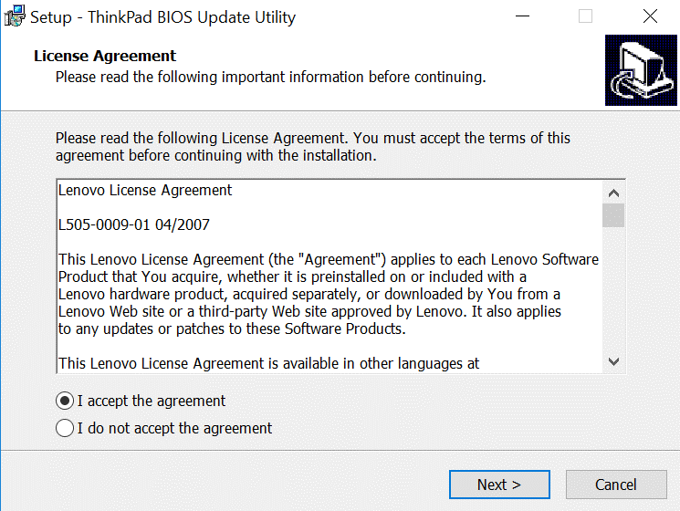  
_**Step 1**: Accept the EULA and click **Next**._

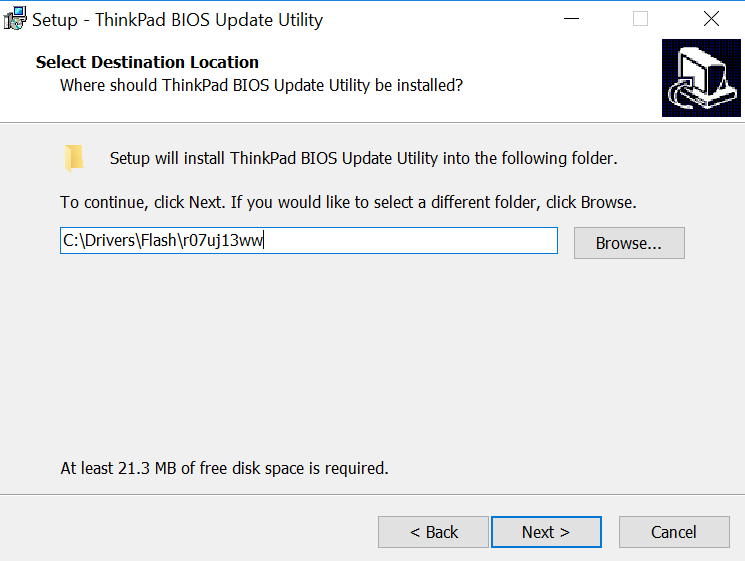  
_**Step 2**: Leave the default location selected for extraction and click **Next**._

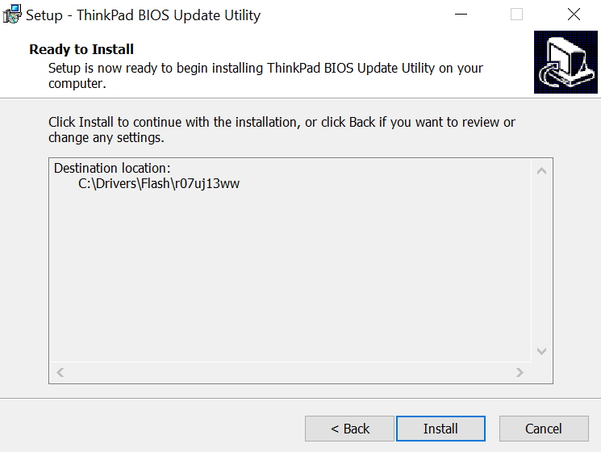  
_**Step 3**: Click **Install**. The program will extract to the default location on the hard drive._

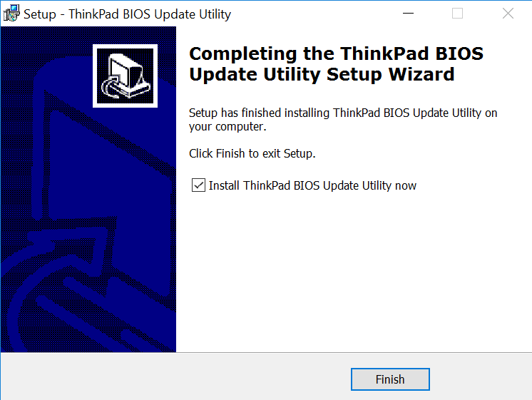  
_**Step 4**: Once completed, the installer should have a check mark on the page. Leave the check box checked and click **Finish**. This should immediately prompt to begin the BIOS Update._

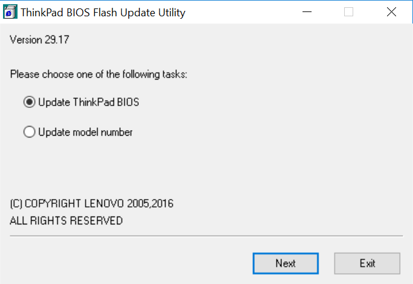 
_**Step 5**: Select Update ThinkPad BIOS if not already selected and click **Next**._

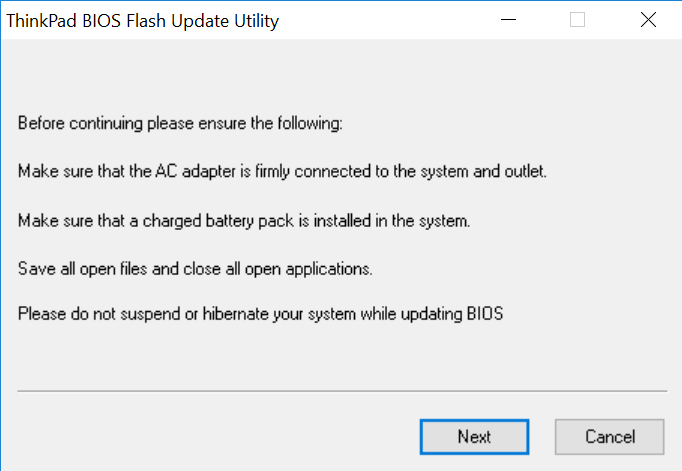 
_**Step 6**: Follow the instructions on this screen and click **Next**._

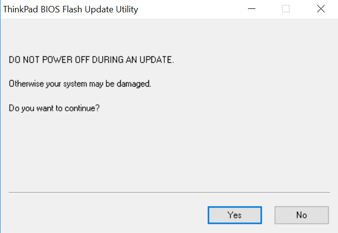 
_**Step 7**: Follow the instructions and click **Yes** to continue._

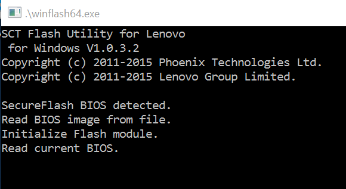  
_**Step 8**: Wait while it prestages the new ROM image file. **DO NOT POWER OFF THE SYSTEM** at this point._

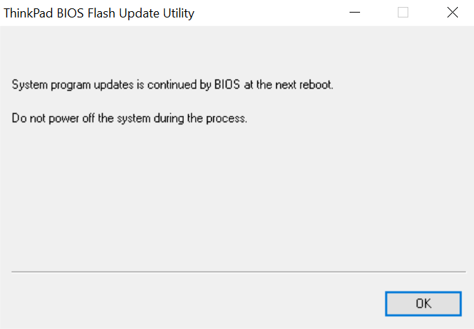  
_**Step 9**: Click **OK** to reboot the system immediately._

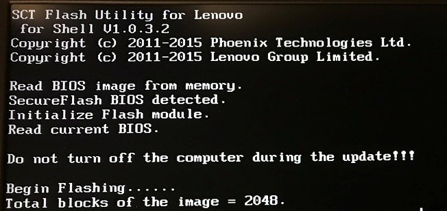  
_**Step 10**: After it reboots, the laptop will begin to write the prestaged BIOS image to the chip. At this point, **DO NOT POWER OFF** the laptop!!!_

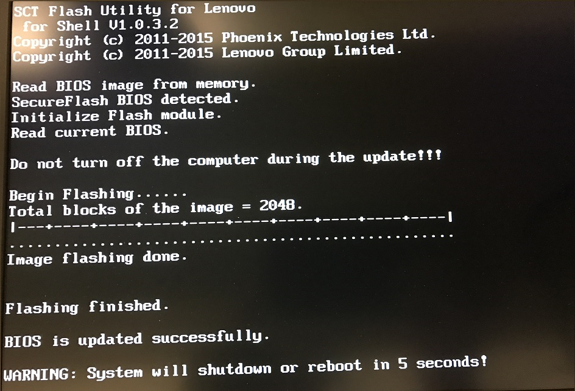  
_**Step 11**: When the BIOS update completes, it will reboot the computer._

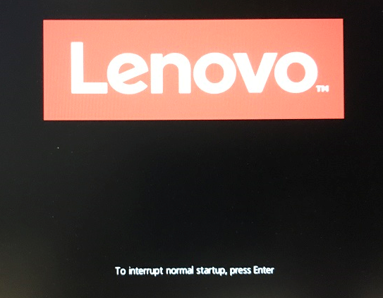  
_**Step 12**: If an update for the Embedded Controller firmware is included in the update, the system will show the splash screen with text stating “Flashing Embedded Controller.” Allow this process to complete and the system will reboot to the OS._

ThinkPad Automated Installation

To automate the ThinkPad BIOS update, the WINUPTP.exe and WINUPTP64.exe both have a –s command line parameter to suppress any prompts or message boxes from displaying during installation of the update. WINUPTP.exe and WINUPTP64.exe also supports a –r command line parameter to force a reboot after prestaging the new BIOS image file. During the reboot, the computer may boot three times, once to apply the BIOS update to the ROM, once to potentially install an embedded controller update, and a final time to boot back into the operating system.

Assuming that the BIOS update is to be applied during a task sequence, from either MDT or SCCM, in the full operating system, there are a few items that need to be touched on. First, installing the BIOS update from a local hard drive is the safest choice. Since that is a requirement, use a copy command to copy the BIOS installer from the network to the local hard drive. Second, in a step to run an executable, call the WINUPTP.exe or WINUPTP64.exe with the –s command line parameter. The final step is to initiate a system reboot through the task sequence.

?>NOTE: It is best practice to not use the –r command line parameter in a task sequence. When running task sequences, it is best practice to allow the task sequence to control the reboot and not allow the installing executable to do so. Allowing the task sequence to control the reboot will allow the task sequence to make all necessary changes to the computer, including setting up to resume the task sequence in the correct location after the reboot sequence has completed.

When updating a ThinkPad BIOS, if a Supervisor password is set and the “Flash BIOS Updating by End-Users” is set to factory default (Enabled), there are no additional steps to be taken to update the BIOS. If the “Flash BIOS Updating by End-Users” is not set to factory default (Enabled), then steps will need to be taken to switch the setting to Enabled using the Think BIOS Configuration Tool or the BIOS Settings VBScripts. After that is set to allow the update to be run, the BIOS can be updated. If needed, utilize the tools mentioned to change the setting back after applying the BIOS update. 

ThinkCentre Manual Installation

ThinkCentre executes Flash.cmd from the extracted files location. To manually install a ThinkCentre BIOS update, navigate to the Lenovo Support page, enter in the model of ThinkCentre, and download the “Flash UEFI BIOS update (Flash from operating system version)”. After it is downloaded, run the downloaded program to begin the extraction process.

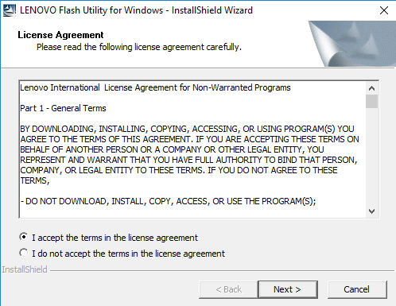  
_**Step 1**: Accept the EULA and click **Next**._

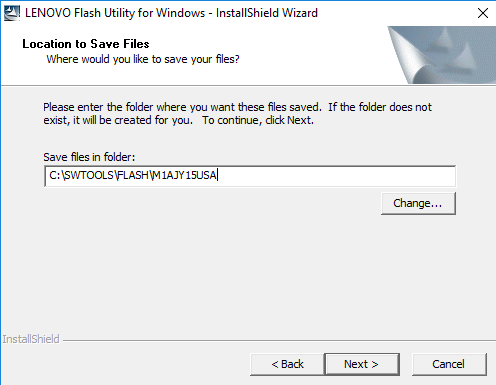  
_**Step 2**: Leave the default location selected for extraction and click **Next**. This will extract the files and then automatically kick off the installation.._

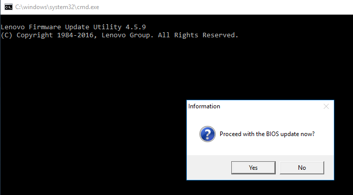  
_**Step 3**: Click **Yes** to continue with the BIOS update._

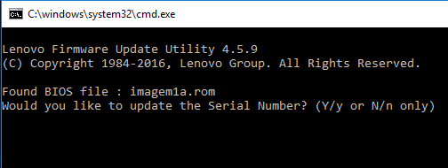  
_**Step 4**: Press the “N” key and press._

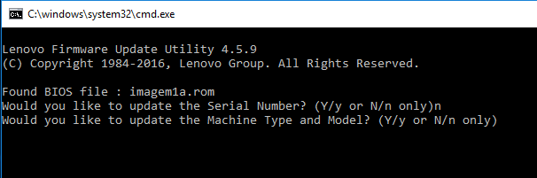  
_**Step 5**: Press the “N” key and press . Once is pressed, a command window will pop up with yellow writing. Wait while it loads the ROM file into the BIOS update inbox. **DO NOT POWER OFF THE SYSTEM** at this point. The system will reboot on its own._

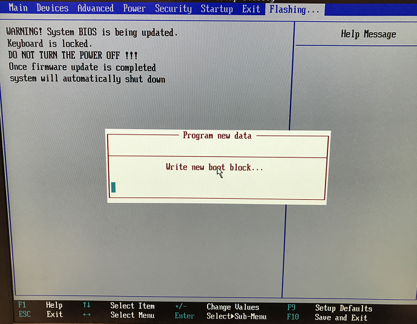  
_**Step 6**: Writing the new boot block._

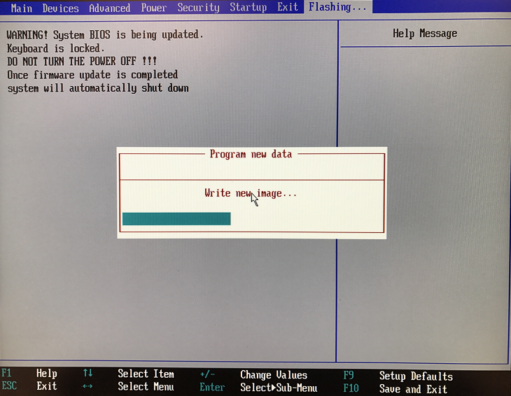  
_**Step 7**: Writing the new image._

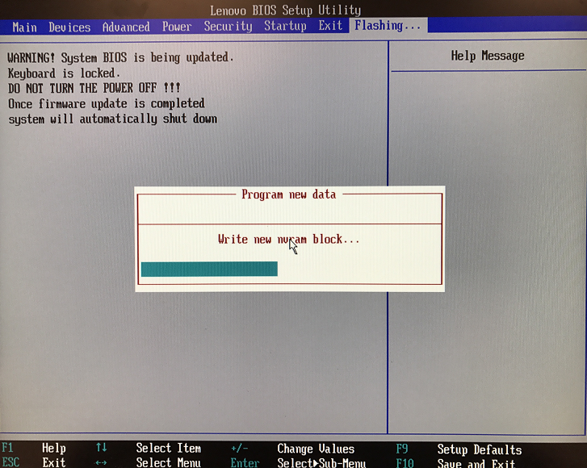  
_**Step 8**: Writing the new nvram block._

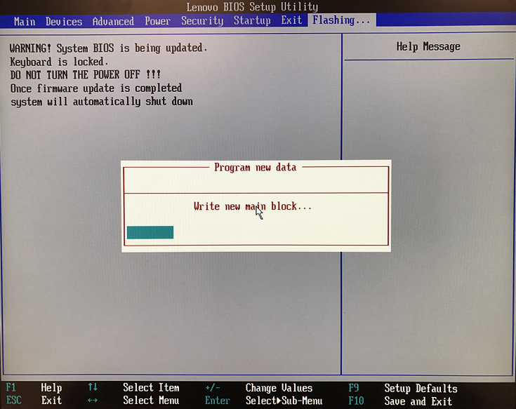  
_**Step 9**: Writing the new main block. After writing the main block, the computer will reboot on its own. It may restart a second time if it needs to program the embedded controller._

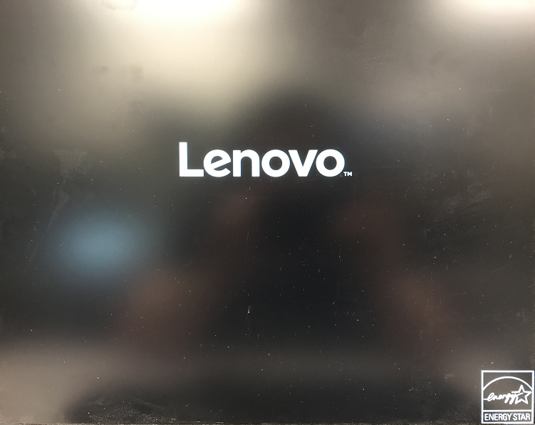  
_**Step 10**: Booting up._

