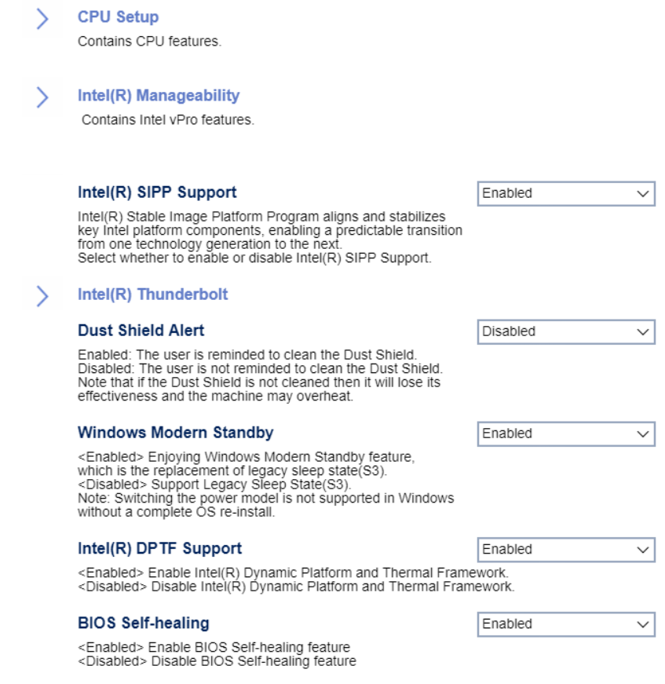

# Advanced #

Intel(R) SIPP Support

Intel(R) Stable Image Platform program aligns and stabilizes
key Intel platform components, enabling a predictable transition
from one technology generation to the next.

One of 2 possible options for SIPP:

1. **Enabled** - enables SIPP. Default.
2. Disabled - disables SIPP.

<!-- TODO: WMI
| WMI Setting name | Values | SVP Req'd | AMD/Intel |
|:---|:---|:---|:---|
| IntelSIPPSupport | setting_values | yes_no | amd_intel |
-->

Dust Shield Alert

The user is reminded to clean the Dust Shield.
One of 2 possible options for the Dust Shield reminder:

1.  **Enabled** - enables the Dust Shield alert. Default.
2.  Disabled - disables the Dust Shield alert.

<!-- TODO: add WMI
| WMI Setting name | Values | SVP Req'd | AMD/Intel |
|:---|:---|:---|:---|
| DustShieldAlert | setting_values | yes_no | amd_intel |
-->
**Note:**  If the Dust Shield is not cleaned, it will lose its effectiveness and the machine may overheat.

Intel (R) DPTF Support

Intel(R) Dynamic Platform and Thermal Framework.

One of 2 possible options for DPTF:

1.  **Enabled** - enables DPTF. Default.
2.  Disabled - disables DPTF.

<!-- TODO: WMI -->

Windows Modern Standby

[Windows Modern Standby](https://docs.microsoft.com/en-us/windows-hardware/design/device-experiences/modern-standby) is the replacement for the legacy Sleep state.

One of 2 possible options for Windows Modern Standby:

1. **Enabled** - enables Windows Modern Standby. Default.
2. Disabled - disables Windows Modern Standby.

<!-- TODO: add WMI-->

BIOS Self-healing

One of 2 possible options for BIOS Self-healing:

1.  **Enabled** - enables BIOS Self-healing. Default.
2.  Disabled - disables BIOS Self-healing.

<!--
| WMI Setting name | Values | SVP Req'd | AMD/Intel |
|:---|:---|:---|:---|
| BIOSSelfHealing  | setting_values | yes_no | amd_intel |
-->

