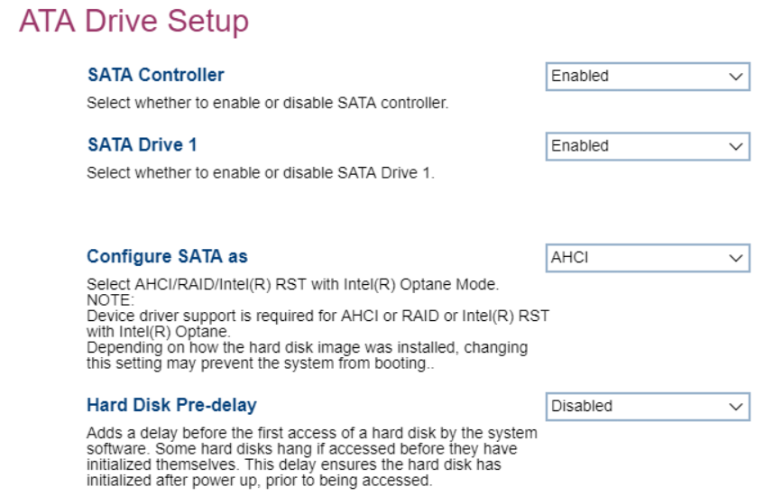

# ATA Drive Setup #

SATA Controller

Serial AT Attachment (SATA) drive access.

Options:

1.  **Enable** - Default.
2.  Disable.

<!-- 
| WMI Setting name | Values | SVP Req'd | AMD/Intel |
|:---|:---|:---|:---|
| SATAController | setting_values | yes_no | amd_intel |
-->
?>: If the `SATA Controller` is set to `Disabled`, then `Configure SATA as` and `SATA Drive {Number}` will be hidden.

SATA DRIVE {Number}

One of the (Serial AT Attachment) Drives. Total number of drives depends on model.

Options:

1.  **Enabled** - enables this SATA drive. Default.
2.  Disabled - disables this SATA drive.

<!-- 
| WMI Setting name | Values | SVP Req'd | AMD/Intel |
|:---|:---|:---|:---|
| SATADrive1 | setting_values | yes_no | amd_intel |

?> The WMI setting name for Drive 1 is shown. Other drives follow the pattern `SATADrive#` where `#` is the number of the drive.
-->

Configure SATA As

Configure the SATA (Serial AT Attachment) drive controller.

?> Device driver support is required  for AHCI or Intel(R) RST with Intel(R) Optane.

!> Depending on how the hard disk image was installed, changing this setting may prevent the system from booting.

Options:

1.  **AHCI** - enables AHCI (Advanced Host Controller Interface). Default.
2.  Intel (R) RST with Intel (R) Optane mode - enables RST (Rapid Storage Technology).
3.  RAID - enables RAID. <!-- MODEL: M70S Gen3 only-->

<!-- TODO: add WMI -->

Hard Disk Pre-Delay

Ensures the hard disk has initialized after power up, prior to being accessed. This avoids the disk hanging because of access by the OS before initialization.

Options:

1.  **Disabled** - enables delay. Default.
2.  3 - 30 seconds - enables delay, in increments of 3 seconds up 15, then 21 or 30.

<!-- TODO: add WMI -->

