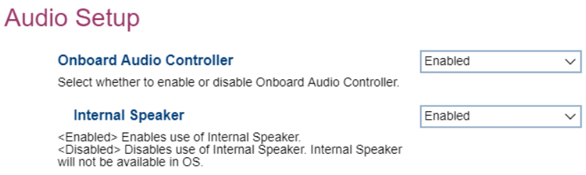

# Audio Setup #

Onboard Audio Controller

Options:

1.  **Enabled** - enables onboard audio controller. Default.
2.  Disabled - disables onboard audio controller.

<!-- TODO: add WMI -->

Internal Speaker

Options:

1.  **Enabled** - enables the internal speaker. Default.
2.  Disabled - disables the internal speaker.

<!-- TODO: add WMI -->

<!-- MODEL: NOT M90q -->

