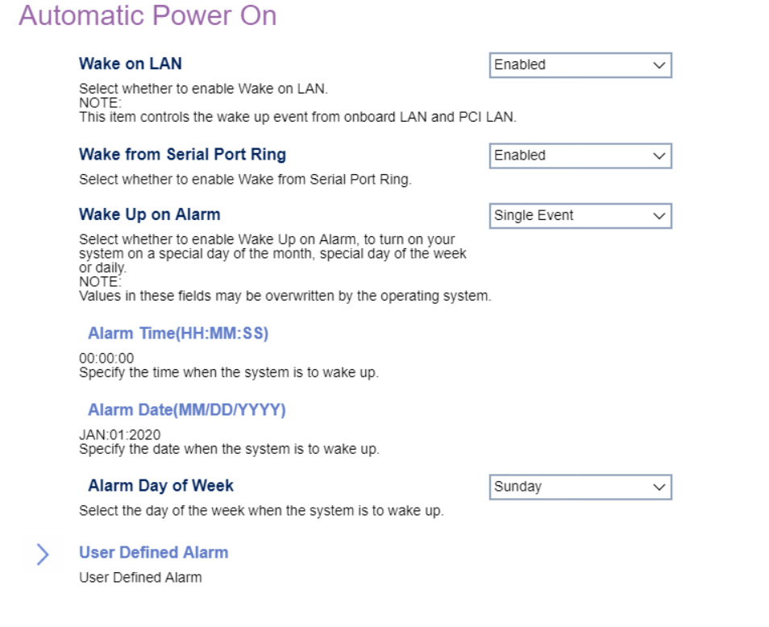

# Automatic Power On #

Wake on LAN

Controls the wake up event from onboard LAN and PCI LAN.
One of 2 possible options for Wake on LAN:

1.  **Enabled** - enables Wake on LAN. Default.
2.  Disabled - disables Wake on LAN.

<!-- TODO: add WMI
| WMI Setting name | Values | SVP Req'd | AMD/Intel |
|:---|:---|:---|:---|
| WakeonLAN | setting_values | yes_no | amd_intel |
-->

Wake from Serial Port Ring

Select whether to enable Wake from Serial Port Ring., and/or which Startup Sequence to use after a serial port wake event.
One of 3 possible options for Wake from Serial Port Ring:

1. **Enabled** - enables Wake from Serial Port Ring. Default.
2. Disabled - disables Wake from Serial Port Ring.

<!-- 
| WMI Setting name | Values | SVP Req'd | AMD/Intel |
|:---|:---|:---|:---|
| WakefromSerialPortRing | setting_values | yes_no | amd_intel |
-->

Wake Up on Alarm

Options to turn on your system on a specific day of the month, specific day of the week, or daily at a given time. A single wake up event, or series of alarm events, can also be defined.
One of 5 possible options for Wake Up on Alarm:

1.  **Disabled** - Disables Wake Up on Alarm. Default.
2.  User Defined - a series of alarm events.
3.  Single Event
4.  Daily Event
5.  Weekly Event

<!-- 
| WMI Setting name | Values | SVP Req'd | AMD/Intel |
|:---|:---|:---|:---|
| WakeUponAlarm | setting_values | yes_no | amd_intel |
-->

**Note:**  Selecting `User Defined` enables the `User Defined Alarm` settings.

**Note:**  Values in these fields may be overwritten by the operating system.

Startup Sequence

Select the startup sequence after a Wake Up on Alarm event.
One of 2 possible options for startup sequence:

1.  **Primary** - enables primary startup sequence. Default.
2.  Automatic - disables automatic selection of startup sequence.

<!-- TODO: add WMI
| WMI Setting name | Values | SVP Req'd | AMD/Intel |
|:---|:---|:---|:---|
| setting_name | setting_values | yes_no | amd_intel |
-->

### Alarm Time (HH : MM : SS) ###

Specify the time when the system is to wake up.

<!-- SIMULATOR DOES NOT SUPPORT -->

### Alarm Date (MM / DD / YYYY) ###

Alarm Day of Week.

<!-- SIMULATOR DOES NOT SUPPORT -->

### User Defined Alarm ###

Select the day(s) of the week when the system is to wake up.

Sunday
One of 2 possible options for waking up this day:

1.  **Disabled** - disables wake-up. Default.
2.  Enabled - enables wake-up.

Monday
One of 2 possible options for waking up this day:

1.  **Disabled** - disables wake-up. Default.
2.  Enabled - enables wake-up.

Tuesday
One of 2 possible options for waking up this day:

1.  **Disabled** - disables wake-up. Default.
2.  Enabled - enables wake-up.

Wednesday
One of 2 possible options for waking up this day:

1.  **Disabled** - disables wake-up. Default.
2.  Enabled - enables wake-up.

Thursday
One of 2 possible options for waking up this day:

1.  **Disabled** - disables wake-up. Default.
2.  Enabled - enables wake-up.

Friday
One of 2 possible options for waking up this day:

1.  **Disabled** - disables wake-up. Default.
2.  Enabled - enables wake-up.

Saturday
One of 2 possible options for waking up this day:

1.  **Disabled** - disables wake-up. Default.
2.  Enabled - enables wake-up.

User Defined Alarm Time (HH : MM : SS)

Specify the time when the system is to wake up.

<!-- SIMULATOR DOES NOT SUPPORT -->

