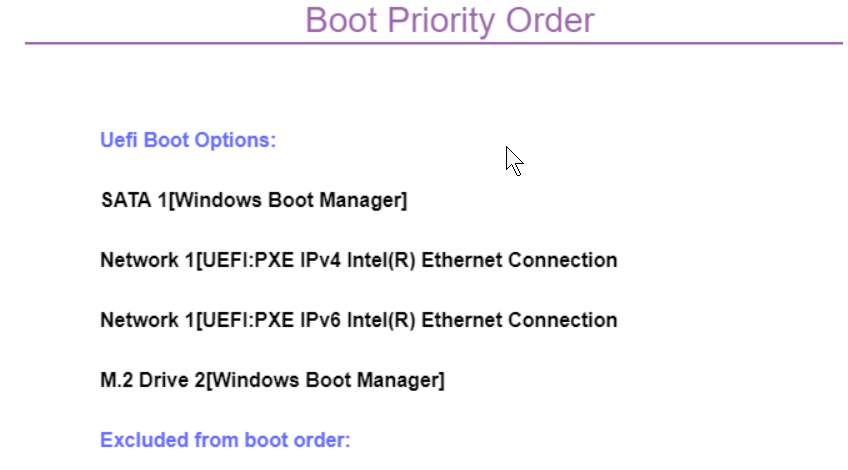
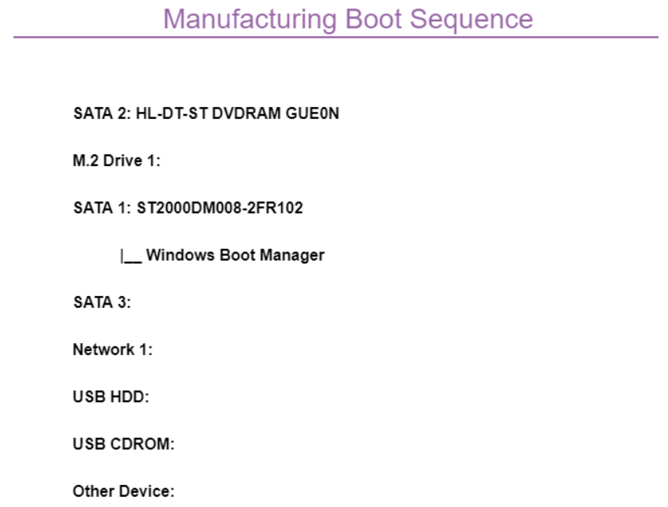

# Boot Priority Order #

This sequence is used when the system is powered up normally.

?> Use up and down arrows to select. `+` and `-` increase or decrease priority. Use `x` to exclude the device from the boot sequence.

The exact BIOS interface is determined by the model.

| WMI Setting name | Values | Locked by SVP |
|:---|:---|:---|
| BootOrder |  |  |

<!-- MODEL: M70s, M90 s & q -->

<!-- MODEL: M90q -->
