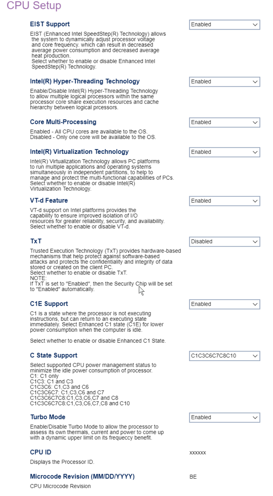

# CPU Setup #

EIST Support

EIST (Enhanced Intel SpeedStep(R) Technology) dynamically adjusts processor voltage and core frequency, to decrease average power consumption and heat production.

One of 2 possible options for EIST support:

1.  **Enabled** - enables EIST support. Default.
2.  Disabled - enables EIST support.

<!-- TODO: add WMI
| WMI Setting name | Values | SVP Req'd | AMD/Intel |
|:---|:---|:---|:---|
| EISTSupport | setting_values | yes_no | amd_intel |
-->

Intel(R) Hyper-Threading Technology

Intel(R) Hyper-Threading Technology allows multiple logical processors within the same processor core to share execution resources and cache hierarchy.

One of 2 possible options for feature:

1. **Enabled** - enables Hyper-Threading Technology. Default.
2. Disabled - disables Hyper-Threading Technology.

<!-- TODO: add WMI
| WMI Setting name | Values | SVP Req'd | AMD/Intel |
|:---|:---|:---|:---|
| HyperThreadingTechnology | setting_values | yes_no | amd_intel |
-->

Core Multi-Processing

Whether all CPU (multi-)cores are available to the OS, or only one core.

One of 2 possible options for multi-processing:

1.  **Enabled** - enables multi-processing. Default.
2.  Disabled - disables multi-processing.

<!-- TODO: add WMI
| WMI Setting name | Values | SVP Req'd | AMD/Intel |
|:---|:---|:---|:---|
| CoreMultiProcessing | setting_values | yes_no | amd_intel |
-->

Intel(R) Virtualization Technology

Intel(R) Virtualization Technology multiple applications and operating systems to run simultaneously in independent partitions.

One of 2 possible options for Intel(R) Virtualization Technology:

1.  **Enabled** - enables Intel(R) Virtualization Technology. Default.
2.  Disabled - disables Intel(R) Virtualization Technology.

<!-- TODO: add WMI
| WMI Setting name | Values | SVP Req'd | AMD/Intel |
|:---|:---|:---|:---|
| VirtualizationTechnology | setting_values | yes_no | amd_intel |
-->

VT-d Feature

VT-d provides improved isolation of I/O resources for greater reliability, security, and availability.

One of 2 possible options for VT-d:

1.  **Enabled** - enables VT-d. Default.
2.  Disabled - disables VT-d.

<!-- TODO: add WMI
| WMI Setting name | Values | SVP Req'd | AMD/Intel |
|:---|:---|:---|:---|
| VTdFeature | setting_values | yes_no | amd_intel |
-->

TxT

Trusted Execution Technology (TxT) provides hardware-based mechanisms to protect against software-based attacks, and protect data stored or created on the client.

One of 2 possible options for TxT:

1.  **Enabled** - enables TxT. Default.
2.  Disabled - disables TxT.

<!-- 
| WMI Setting name | Values | SVP Req'd | AMD/Intel |
|:---|:---|:---|:---|
| TXTFeature | setting_values | yes_no | amd_intel |
-->

C1E Support

Enhanced C1 state (C1E) is where the processor is not executing instructions (but can return to an executing state immediately), to reduce power consumption.

One of 2 possible options for C1E Support:

1.  **Enabled** - enables C1E Support. Default.
2.  Disabled - disables C1E Support.

<!-- TODO: add WMI
| WMI Setting name | Values | SVP Req'd | AMD/Intel |
|:---|:---|:---|:---|
| C1ESupport | setting_values | yes_no | amd_intel |
-->

C State Support

Select supported CPU power management status to minimize the idle power consumption of processor.

One of 6 possible options for C states:

1. C1 - C1 only
1. C1C3 - C1 and C3
1. C1C3C6 - C1,C3 and C6
1. C1C3C6C7 - C1,C3,C6 and C7
1. C1C3C6C7C8 - C1,C3,C6,C7 and C8
1. C1C3C6C7C8C10 - C1,C3,C6,C7,C8 and C10

<!--
| WMI Setting name | Values | SVP Req'd | AMD/Intel |
|:---|:---|:---|:---|
| CStateSupport | setting_values | yes_no | amd_intel |
-->

Turbo Mode

Turbo Mode allows the processor to assess its own thermals, current, and power, to calculate a dynamic upper limit on its frequency benefit.

One of 2 possible options for Turbo Mode:

1. **Enabled** - enables Turbo Mode. Default.
2. Disabled - disables Turbo Mode.

<!--- TODO: add WMI
| WMI Setting name | Values | SVP Req'd | AMD/Intel |
|:---|:---|:---|:---|
| TurboMode | setting_values | yes_no | amd_intel |
-->

CPU ID

Displays the processor ID.

<!-- TODO: styles -->

Microcode Revision (MM/DD/YYYY)

CPU microcode revision.

<!-- TODO: styles -->

