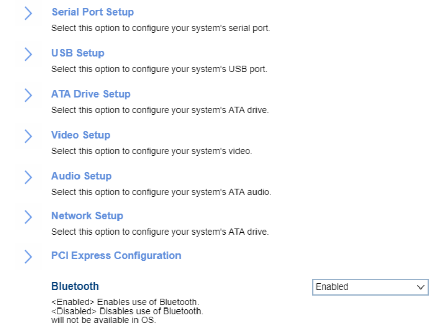

# Devices #

Bluetooth

One of 2 possible options for Bluetooth:

1.  **Enabled** - enables Bluetooth connections. Default.
1.	Disabled - disables Bluetooth connections. Bluetooth will not be available in the OS.

Card Reader

One of 2 possible options for card reader settings:

1.  **Enabled** - enables card reader. Default.
1.  Disabled - disables card reader.

<!-- TODO: add WMI -->

<!-- MODEL: S only -->

