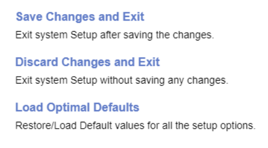

# Exit

### Save Changes and Exit ###

Exit system setup after saving the changes.

**WARNING:** Save configuration and reset.

### Discard Changes and Exit ###

Exit system setup without saving any changes.

**WARNING:** Reset without saving.

### Load Optimal Defaults ###

Restore/Load default values tor all the setup options.

**WARNING:** Load default configuration.

