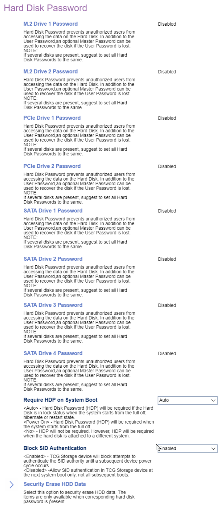

# Hard Disk Password #

<!-- MODEL: M70s disabled, M70q, M90 s & q enter -->

One setting per drive. Total number of drives depends on model.

All of the following passwords default to `Disabled`.

A Hard Disk Password prevents unauthorized users from accessing the data from the hard disk.

In addition to the User Password, a optional Master Password can be used to recover the disk if the user password is lost.

?> If several disks are present, we recommend setting all Hard Disk Passwords to the same.

<!-- TODO: Is this really a good recommendation? -->

<!-- TODO: confirm behavior -->

M.2 Drive {Number} Password

Options:

1. **Disabled** - Default.
1. Single Password
1. Dual Password (Admin + User)

PCIe Drive {Number} Password

Options:

1. **Disabled** - Default.
1. Single Password
1. Dual Password (Admin + User)

SATA Drive {Number} Password

Options:

1. **Disabled** - Default.
1. Single Password
1. Dual Password (Master + User)

 

Require HDP on System Boot

Hard Disk Password (HDP).

Options:

1.  **Auto** - HDP will be required if the Hard Disk is in lock status when the system starts from the full off, hibernate or restart state. Default.
2.  Power On - HDP will be required when the system starts from the full off or hibernate state.
3.  No - HDP will not be required. However, HDP will be required when the hard disk is attached to a different system.

<!-- TODO: add WMI
| WMI Setting name | Values | SVP Req'd | AMD/Intel |
|:---|:---|:---|:---|
| RequireHDPonSystemBoot | setting_values | yes_no | amd_intel |
-->

Block SID Authentication

Options:

Options:

1.  **Enabled** - TCG Storage device will block attempts to authenticate the SID authority until a subsequent device power cycle occurs. Default.
2.  Disabled - Allow SID authentication in TCG Storage device at the next system boot only, not all subsequent boots.

<!-- TODO: add WMI
| WMI Setting name | Values | SVP Req'd | AMD/Intel |
|:---|:---|:---|:---|
| BlockSIDAuthentication | setting_values | yes_no | amd_intel |
-->

<!-- TODO: feature confirmation -->
