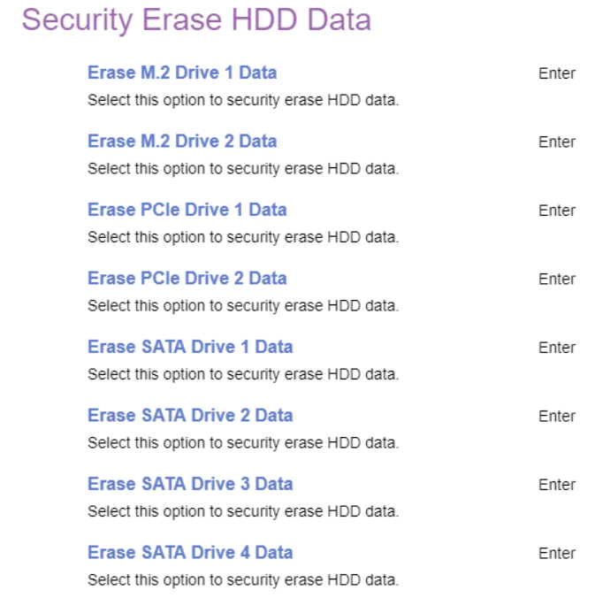

# Hard Disk Password #

<!-- MODEL: M70s disabled, M70q, M90 s & q enter -->

One setting for each of the drives. Total number of drives depends on model.

A Hard Disk Password prevents unauthorized users from accessing the data from the hard disk. In addition to the User Password, a optional Master Password can be used to recover the disk if the user password is lost.

**NOTE** If several disks are present, we recommend setting all Hard Disk Passwords to the same.

<!-- TODO: Is this really a good recommendation? -->

### M.2 Drive {Number} Password ###

### PCIe Drive {Number} Password ###

### SATA Drive {Number} Password ###

 

Require HDP on System Boot

One of 3 possible options for the Hard Disk Password (HDP):

1.  **Auto** - HDP will be required if the Hard Disk is in lock status when the system starts from the full off, hibernate or restart state. Default.
2.  Power On - HDP will be required when the system starts from the full off or hibernate state.
3.  No - HDP will not be required. However, HDP will be required when the hard disk is attached to a different system.

<!-- TODO: add WMI
| WMI Setting name | Values | SVP Req'd | AMD/Intel |
|:---|:---|:---|:---|
| RequireHDPonSystemBoot | setting_values | yes_no | amd_intel |
-->

Block SID Authentication

One of 2 possible options for SID authentication:

1.  **Enabled** - enables SID authentication block. Default.
2.  Disabled - disables SID authentication block.

<!-- TODO: add WMI
| WMI Setting name | Values | SVP Req'd | AMD/Intel |
|:---|:---|:---|:---|
| BlockSIDAuthentication | setting_values | yes_no | amd_intel |
-->

### Security Erase HDD Data ###

Select this option to security erase HDD data.

The items are only available when corresponding hard disk password is present.

**WARNING:** All HDD data will be erased and the hard disk password will be deleted.

Erase M.2 Drive {Number} Data

Securely erase this M.2 Drive data.

Erase PCIe Drive {Number} Data

Securely erase this PCIe Drive data.

Erase SATA Drive {Number} Data

Securely erase this SATA Drive data.

