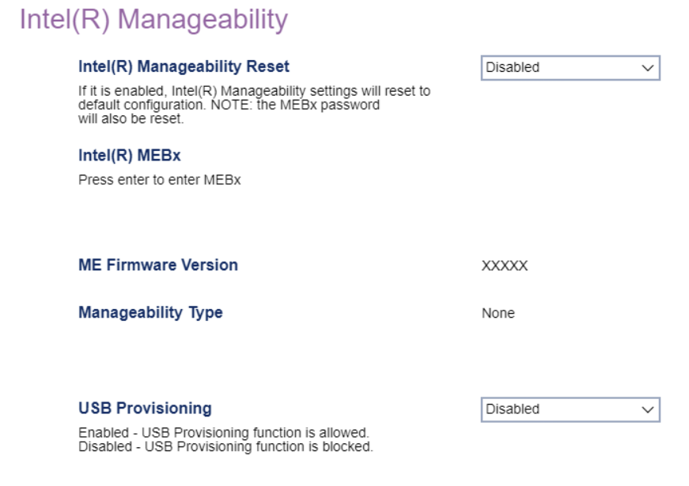

# Intel(R) Manageability #

 - [More information at Intel.com](https://software.intel.com/sites/manageability/AMT_Implementation_and_Reference_Guide/default.htm)

Intel(R) Manageability Reset

Return Intel(R) Manageability settings to default configuration.

Options:

1. **Enabled** - Default.
2. Disabled.

!> the MEBx password will also be reset.

### Intel(R) MEBx ###

Press `Enter` to enter Intel (R) MEBx (Management Engine BIOS Extension).

 - [More information at Intel.com](https://www.intel.com/content/www/us/en/support/articles/000020917/software/manageability-products.html)

### ME Firmware Version (display only) ###

Displays the firmware version.

### Manageability Type (display only) ###

Displays the manageability type.

USB Provisioning

Options:

1.  **Enabled** - Default.
2.  Disabled - disables USB provisioning.

| WMI Setting name | Values | SVP or SMP Req'd |
|:---|:---|:---|
| USBProvisioning | Disabled, Enabled | yes |

