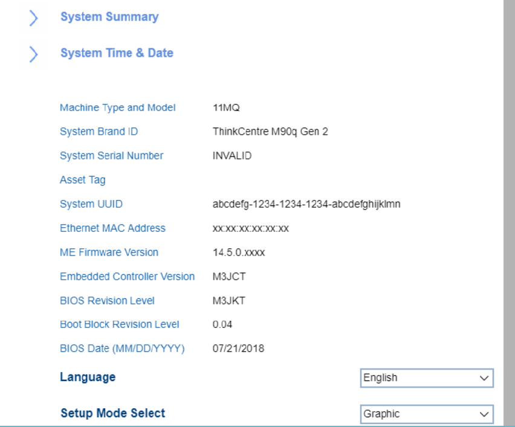
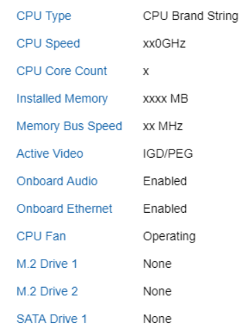
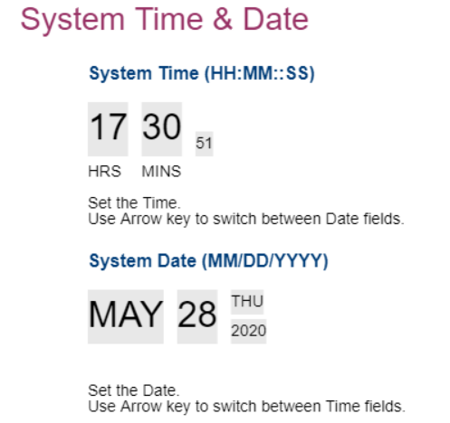

# Main #

System Summary

Displays system information, including:

 - CPU
 - Memory
 - Video / Audio
 - Ethernet
 - Fan
 - Drives

System Time and Date

Shows the current system time and date. Can be changed.

Language

One of 4 possible options for Language:

1.  **English**
2.	French
3.  Russian
4.  Chinese (Mandarin)

Setup Mode Select

One of 2 possible options for interface of Setup Mode:

1.  **Text** - enables simple text interface with navigation and actions available only via keyboard. Default.
2.	Graphic - enables graphical interface with possibility to additionally use mouse for navigation and actions.

<!-- TODO: add WMI -->

