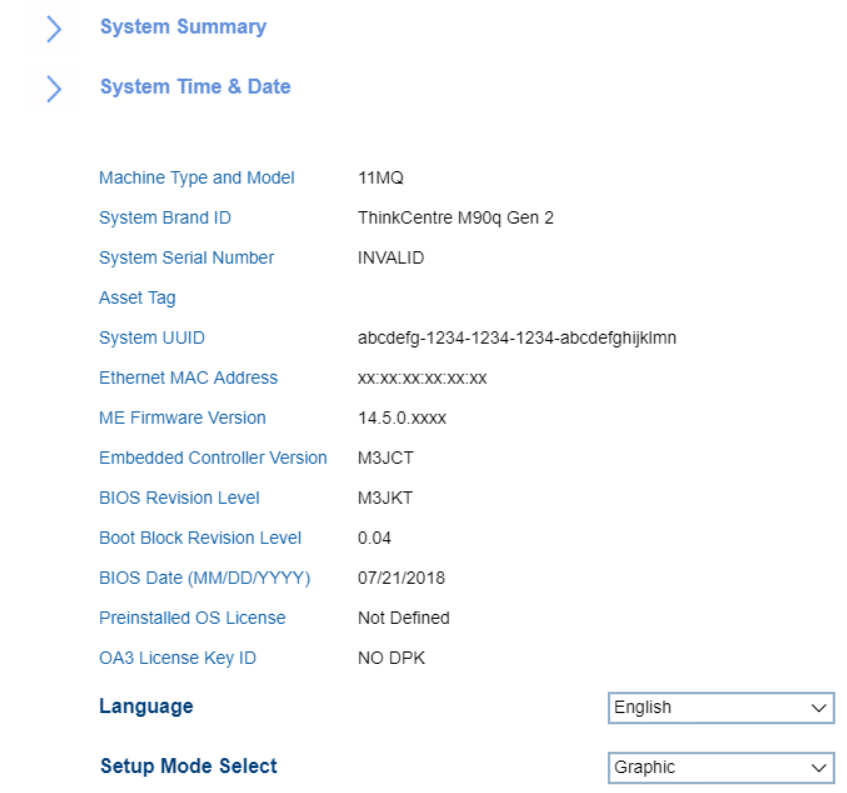

# Main #

### System Summary ###

Displays system information, including:

 - CPU
 - Memory
 - Video / Audio
 - Ethernet
 - Fan
 - Drives

System Time and Date

Shows the current system time and date. Can be changed.

<!-- WMI: no -->

Language

Options:

1.  **English**
2.	French
3.  Russian
4.  Chinese (Mandarin)

<!-- WMI: no -->

Setup Mode Select

<!-- MODEL: S only-->

Options:

1.  **Text** - enables simple text interface with navigation and actions available only via keyboard. Default.
2.	Graphic - enables graphical interface with possibility to additionally use mouse for navigation and actions.

<!-- WMI: no -->

