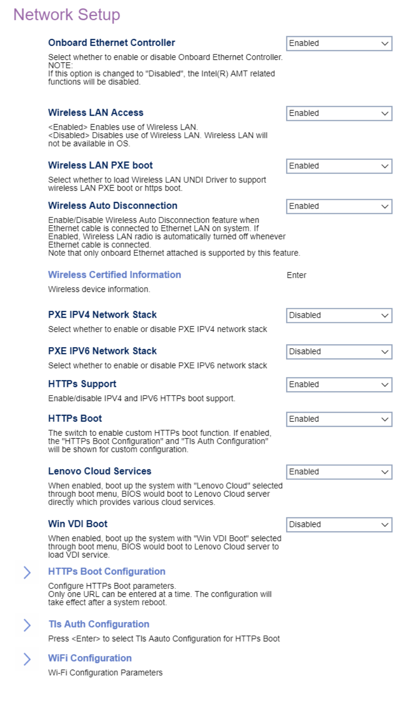

# Network Setup #

Onboard Ethernet Controller

One of 2 possible options for the onboard ethernet controller:

1.  **Enabled** - enables the onboard ethernet controller. Default.
2.  Disabled - disables all [Intel (R) AMT](https://software.intel.com/sites/manageability/AMT_Implementation_and_Reference_Guide/default.htm) related functions.

<!-- TODO: add WMI --> 

Wireless LAN Access

Controls access to wifi.
One of 2 possible options for wireless LAN (wifi):

1.  **Enabled** - enables wireless LAN. Default.
2.  Disabled - enables wireless LAN.

<!-- TODO: add WMI --> 

Wireless LAN PXE boot

Select whether to load Wireless LAN UNDI Driver to support wireless LAN PXE boot or https boot.

One of 2 possible options for PXE support:

1.  **Disabled** - disables PXE. Default.
2.  Enabled - enables PXE.

<!-- TODO: add WMI --> 

Wireless Certified Information

<!-- SIMULATOR DOES NOT SUPPORT -->

Wireless Auto Disconnection

Disable wireless LAN when onboard Ethernet is connected.
One of 2 possible options for auto disconnection:

1.  **Disabled** - enables auto disconnection. Default.
2.  Enable - enables auto disconnection.
<!-- TODO: add WMI
| WMI Setting name | Values | SVP Req'd | AMD/Intel |
|:---|:---|:---|:---|
| WirelessAutoDisconnection | setting_values | yes_no | amd_intel |
-->

PXE IPV4 Network Stack

One of 2 possible options for IPV4 PXE:

1.  **Disabled** - enables IPV4 PXE. Default.
2.  Enabled - enables IPV4 PXE.

<!-- TODO: add WMI
| WMI Setting name | Values | SVP Req'd | AMD/Intel |
|:---|:---|:---|:---|
| PXEIPV4NetworkStack | setting_values | yes_no | amd_intel |
-->

PXE IPV6 Network Stack

One of 2 possible options for IPV6 PXE:

1.  **Disabled** - enables IPV6 PXE. Default.
2.  Enabled - enables IPV6 PXE.

<!-- TODO: add WMI
| WMI Setting name | Values | SVP Req'd | AMD/Intel |
|:---|:---|:---|:---|
| PXEIPV6NetworkStack | setting_values | yes_no | amd_intel |
-->

HTTPS Boot

Custom HTTPS boot.
One of 2 possible options for custom HTTPS boot:

1.  **Disabled** - disables custom HTTPS boot. Default.
2.  Enabled - enables custom HTTPS boot.

> **Note** If enabled, `HTTPs Boot Configuration` and `Tls Auth Configuration` will be shown.

Lenovo Cloud Services

When enabled, boot with `Lenovo Cloud` selected in boot menu to boot from Lenovo Cloud server directly.

One of 2 possible options for Lenovo Cloud Services:

1.  **Disabled** - enables Lenovo Cloud Services. Default.
2. Enabled - enables Lenovo Cloud Services.

Win VDI Boot

When enabled, boot with `Win VDI Boot` selected in boot menu to boot from Lenovo Cloud server and load VDI service.

One of 2 possible options for Win VDI Boot:

1. **Disabled** - enables Win VDI Boot. Default.
2. Enabled - enables Win VDI Boot.

### HTTPs Boot Configuration  ###

Configure HTTPs Boot parameters.

> <i>Only one URL can be entered at a time. The configuration will take effect after a system reboot.</i>

Input the description

> <i>Press `Enter` to input a label for new created URL and it will be displayed in the boot sequence menu.</i>

Internet Protocol

One of 2 possible options for IP version:

1.  **Ipv4** - enables IPV4. Default.
2.  Ipv6 - enables IPV6.

Boot URL

Create a new boot option based on a HTTPS URL.

> <i> Use the [TLS Auth configuration] to import the CA to
support the HTTPs boot </i>

Delete HTTPs Boot Option from List

> <i> Select and press `Enter` to remove an EFI HTTPs boot option.</i>.

### TLS Auth Configuration ###

Server CA configuration.

> <i>Press `Enter` to select TLS auto configuration for HTTPS boot.</i>

### WiFi Configuration ###

Automatic Connection Support

Automatically connect to WiFi on boot.

One of 2 possible options for Automatic connection:

1. **Enabled** - enables automatic connection. Default.
2. Disabled - enables automatic connection.

Current Connection

Wi-Fi Scan

Press `Enter` to scan the available connections.

Scanned List

