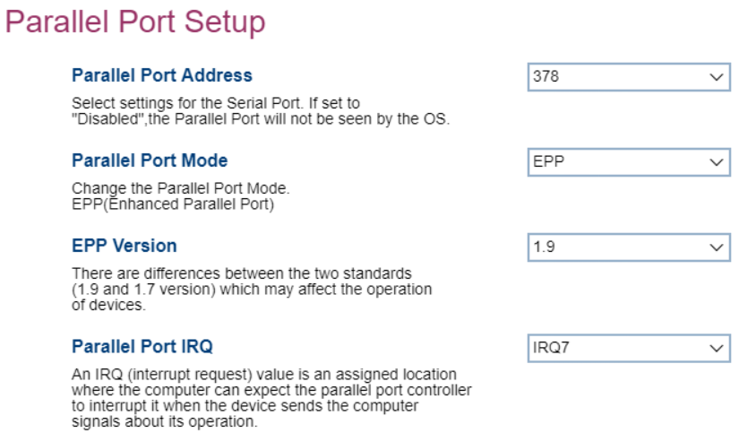

# Parallel Port Setup #

<!-- MODEL: S only -->

Parallel Port Address

One of 3 possible options for parallel port address:

1.  **378** - enables logical parallel port 378. Default.
2.  278 - enables logical parallel port 278.
3.  Disabled - disables the parallel port.

<!-- TODO: add WMI -->

Parallel Port Mode

The parallel port mode has only one value: EPP (Enhanced Parallel Port).

<!-- TODO: add WMI -->

EPP Version

Version of the EPP (Enhanced Parallel Port) standard used.
One of 2 possible options for EPP standard:

1.  **1.9** - enables version 1.9. Default.
2.  1.7 - enables version 1.7.

<!-- TODO: add WMI -->
> **Note** Version 1.7 is supported as an optional setting for backward compatibility with older devices.

Parallel Port IRQ

Settings for the IRQ (Interrupt Request) line.
One of 2 possible options for IRQ line:

1.  **IRQ7** - enables interrupt line 7. Default.
2.  IRQ 5 - enables interrupt line 5.

<!-- TODO: add WMI -->

