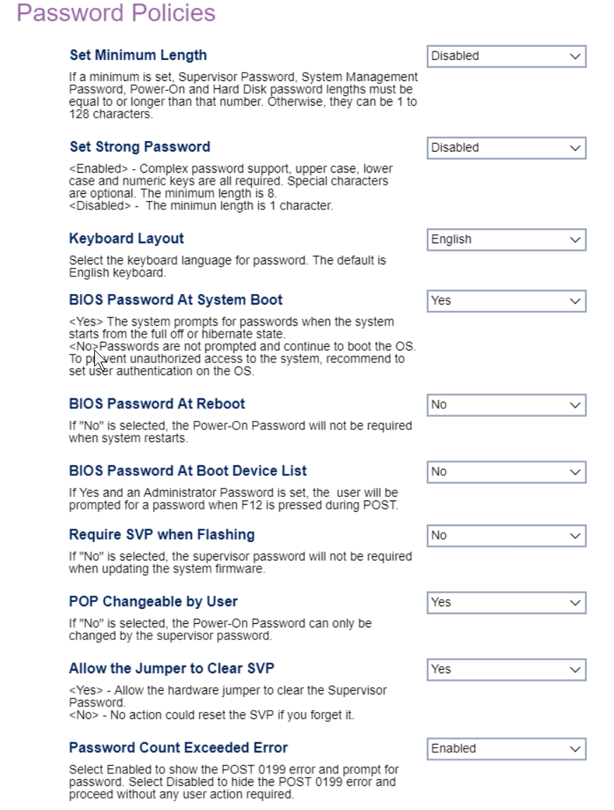

# Password Policies #

Set Minimum Length

One of 10 possible options for password length:

 *  **Disabled** - no minimum (see below). Default.
 *   4 - 12 characters long or more.

**NOTE:** If no minimum is set, passwords may be 1 to 128 characters long.

**NOTE:** If a minimum is set, it applies to:
 - Supervisor Password
 - System Management password
 - Power-on and Hard Disk passwords

**NOTE:** If both `Set Minimum Length` and `Set Strong Password` are enabled, the longest value for minimum length applies.

<!-- 
| WMI Setting name | Values | SVP Req'd | AMD/Intel |
|:---|:---|:---|:---|
| SetMinimumLength | setting_values | yes_no | amd_intel |
-->

Set Strong Password

One of 2 possible options for required password strength:

2.  **Enabled** - enables strong password support. Upper case, lower case and numeric characters are all required. Special characters are optional. The minimum length is 8. Default.
1.  **Disabled** - disables strong password support. The minimum length is 1 character.

<!-- TODO: add WMI
| WMI Setting name | Values | SVP Req'd | AMD/Intel |
|:---|:---|:---|:---|
| SetStrongPassword | setting_values | yes_no | amd_intel |
-->

Keyboard Layout

Select the keyboard language for password.

One of 5 possible options for password keyboard layout (language):

1.  **English** - Default.
2.  French
3.  German
4.  Russian
5.  Chinese

<!-- TODO: add WMI
| WMI Setting name | Values | SVP Req'd | AMD/Intel |
|:---|:---|:---|:---|
| KeyboardLayout | setting_values | yes_no | amd_intel |
-->

BIOS Password At System Boot

One of 2 possible options for BIOS password prompt at system boot (when the system starts from the full off or hibernate state):

1.  **Yes** - enables password prompt. Default.
1.  No - disables password prompt.

**WARNING:** To prevent unauthorized access to the system, recommend to set user authentication on the OS.

BIOS Password At Reboot

Whether the power-on password is required when system restarts.

One of 2 possible options for password on reboot:

2.  **No** - disables password prompt on reboot. Default.
1.  Yes - enables password prompt on reboot.

<!-- TODO: add WMI
| WMI Setting name | Values | SVP Req'd | AMD/Intel |
|:---|:---|:---|:---|
| BIOS Password At Reboot | setting_values | yes_no | amd_intel |
-->

BIOS Password At Boot Device List

If yes and an administrator password is set, the user is prompted for a password when F12 iS pressed during POST.

One of 2 possible options for password prompt during POST:

2.  **No** - disables password prompt during POST. Default.
1.  Yes - enables password prompt during POST.

<!-- TODO: add WMI
| WMI Setting name | Values | SVP Req'd | AMD/Intel |
|:---|:---|:---|:---|
| BIOSPasswordAtBootDeviceList | setting_values | yes_no | amd_intel |
-->

Require SVP when Flashing

Whether the supervisor password is required when updating the system firmware.

One of 2 possible options for password prompt at firmware update:

1.  **No** - disables password prompt at firmware update. Default.
1.  Yes - enables password prompt at firmware update.

<!-- TODO: add WMI
| WMI Setting name | Values | SVP Req'd | AMD/Intel |
|:---|:---|:---|:---|
| RequireSVPwhenFlashing | setting_values | yes_no | amd_intel |
-->

POP Changeable by User

Whether the Power-On Password can be changed by users, or else, only with the supervisor password.

One of 2 possible options for POP change to require SVP:

1.  **Yes** - enables POP change by user. Default.
2.  No - allows POP change only with SVP.

<!-- TODO: add WMI
| WMI Setting name | Values | SVP Req'd | AMD/Intel |
|:---|:---|:---|:---|
| POPChangeablebyUser | setting_values | yes_no | amd_intel |
-->

Allow the Jumper to Clear SVP

Whether to allow the hardware jumper to clear the Supervisor
password.

One of 2 possible options for letting the hardware jumper clear the Supervisor Password:

1.  **Yes** - enables letting the hardware jumper clear the Supervisor Password. Default.
2.  No - disables letting the hardware jumper clear the Supervisor Password.

<!-- TODO: add WMI
| WMI Setting name | Values | SVP Req'd | AMD/Intel |
|:---|:---|:---|:---|
| AllowJumperClearSVP | setting_values | yes_no | amd_intel |
-->

**WARNING** When disabled, no action can reset the SVP if you forget it.

Password Count Exceeded Error

One of 2 possible options for showing the POST 0199 error and password prompt:

1.  **Enabled** - show the POST 0199 error and password prompt.
2.  Disabled - hide the POST 0199 error and proceed Without any user action required. Default.

<!-- TODO: add WMI
| WMI Setting name | Values | SVP Req'd | AMD/Intel |
|:---|:---|:---|:---|
| PasswordCountExceededError | setting_values | yes_no | amd_intel |
-->

