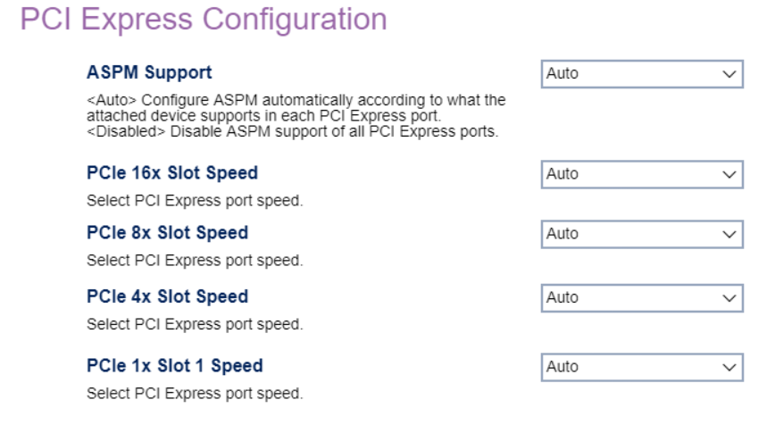

# PCI Express Configuration #

Peripheral Component Interconnect (PCI) Express configuration.

ASPM support

Options for Active-State Power Management (ASPM):

1. **Auto** - Configure ASPM automatically according to what the attached device supports in each PCI Express port. Default.
2. Disable - Disable ASPM support of all PCI Express ports.

<!-- TODO: add WMI
| WMI Setting name | Values | SVP Req'd | AMD/Intel |
|:---|:---|:---|:---|
| setting_name | setting_values | yes_no | amd_intel |
-->

### Select PCI Express port speed. ###

PCIe 16x Slot speed

Options:

1.  **Auto** - Default.
2.  Gen 1.
3.  Gen 2.
4.  Gen 3.
5.  Gen 4.

<!-- MODEL: S only-->

PCIe 8x Slot speed

Options:

1.  **Auto** - Default.
2.  Gen 1.
3.  Gen 2.
4.  Gen 3.
5.  Gen 4.

<!-- MODEL: M90q only -->

PCIe 4x Slot speed

Options:

1.  **Auto** - Default.
2.  Gen 1.
3.  Gen 2.
4.  Gen 3.
5.  Gen 4.

<!-- MODEL: S only-->

PCIe 1x Slot speed

Options:

1.  **Auto** - Default.
2.  Gen 1.
3.  Gen 2.
4.  Gen 3.

<!-- MODEL: not M70 q-->

