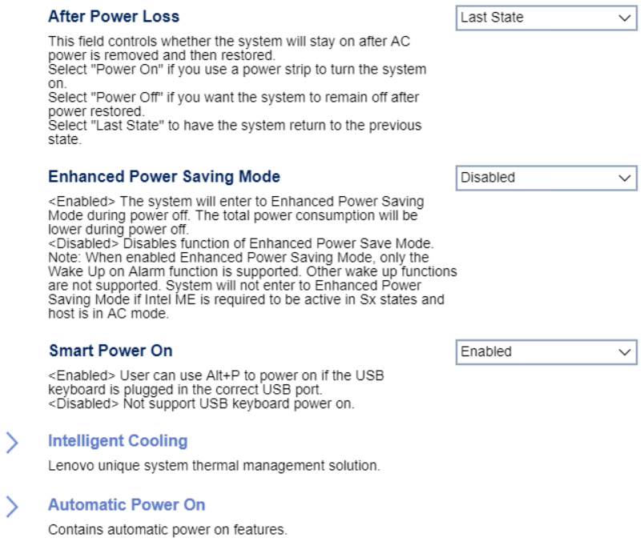

# Power #

After Power Loss

Whether the system will stay on after AC
power is removed and then restored.

One of 3 possible options:

1. **Last State** - return to the previous state. Default.
2.  Power Off - remain off.
3.  Power On - turn on.

<!-- TODO: add WMI
| WMI Setting name | Values | SVP Req'd | AMD/Intel |
|:---|:---|:---|:---|
| AfterPowerLoss | setting_values | yes_no | amd_intel |
-->

**Note:**  Select "Power on" it you use a power strip to turn the system on.

Enhanced Power Saving Mode

The total power consumption is lower during power off.
One of 2 possible options for Enhanced Power Saving Mode:

1. **Disabled** - disables Enhanced Power Saving Mode. Default.
2.  Enabled - enables Enhanced Power Saving Mode.

<!-- 
| WMI Setting name | Values | SVP Req'd | AMD/Intel |
|:---|:---|:---|:---|
| EnhancedPowerSavingMode | setting_values | yes_no | amd_intel |
-->

**Note:** In enhanced power saving mode, only the `Wake up on Alarm` function is supported. Other wake up functions are not. System will not enter `Enhanced Power Saving Mode` if Intel ME is required to be active in Sx states and host is in AC mode. .

Smart Power On

When enabled, the user can use `Alt+P` to power on if a USB keyboard is plugged in the correct USB port.

One of 2 possible options for Smart Power On:

1.  **Enabled** - enables Smart Power On. Default.
2.  Disabled - disables Smart Power On.

<!-- TODO: add WMI
| WMI Setting name | Values | SVP Req'd | AMD/Intel |
|:---|:---|:---|:---|
| SmartPowerOn | setting_values | yes_no | amd_intel |
-->

### Intelligent Cooling  ###

Performance Mode

One of 3 possible options for cooling performance:

1. **Best Performance** - The system will run at best system performance with normal acoustic level. Default.
2. Best Experience - The system will with balanced noise and better performance.
3. Full Speed - All fans in the system will run at full speed.

<!-- TODO: add WMI
| WMI Setting name | Values | SVP Req'd | AMD/Intel |
|:---|:---|:---|:---|
| IntelligentCoolingPerformanceMode | setting_values | yes_no | amd_intel |
-->

### Automatic Power On  ###

