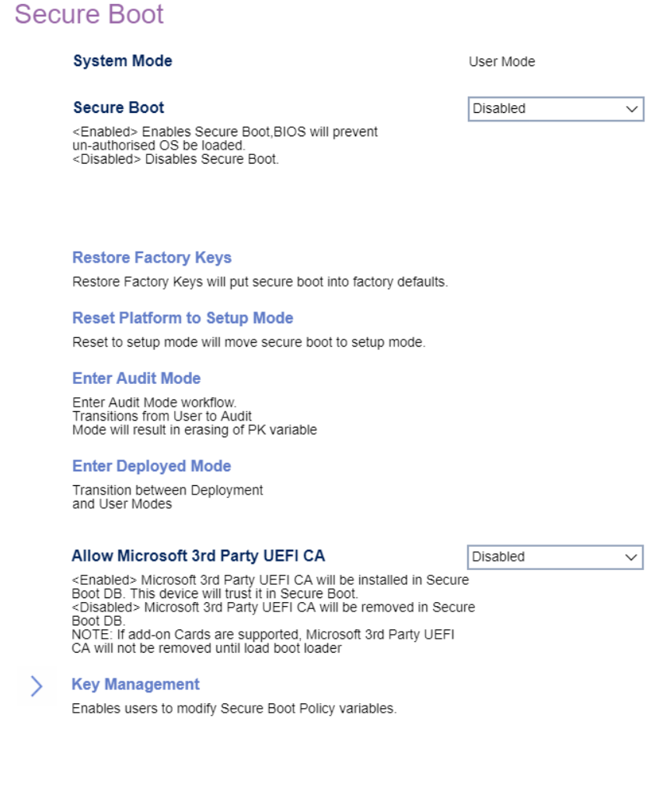

# Secure Boot

### System Mode (display only) ###

<!-- TODO: add description -->

Options:

1. **Deployed Mode** - Default.
1. Audit Mode
1. User Mode
1. Setup Mode

Secure Boot

1.  **Enabled** - BIOS will prevent unauthorized OS from loading.
1.  Disabled - disables Secure Boot.

<!-- TODO: add WMI
| WMI Setting name | Values | SVP Req'd | AMD/Intel |
|:---|:---|:---|:---|
| SecureBoot | setting_values | yes_no | amd_intel |
-->

### Restore Factory Keys ###

Restore Factory Keys resets secure boot to factory defaults.

Press `Yes` to proceed, or `No` to cancel.

### Reset Platform to Setup Mode ###

Reset to setup mode will change secure boot to setup mode.

### Enter Audit Mode ###

Enter Audit Mode workflow.

**NOTE:** Transition from user to Audit Mode will result in erasing PK (Platform Key) variable.

**WARNING:** Removing PK (Platform Key) will reset the system to setup / audit mode.

### Enter Deployed Mode ###

Transition between Deployment and User Modes.

Allow Microsoft 3rd Party UEFI CA

Options:

1.  **Enabled** - Install Microsoft 3rd Party UEFI CA, and trust it in secure boot. Default.
2.  Disabled. Remove Microsoft 3rd Party UEFI CA in secure boot BD.

<!-- | WMI Setting name | Values | SVP Req'd | AMD/Intel |
|:---|:---|:---|:---|
| AllowMicrosoft3rdPartyUEFICA | setting_values | yes_no | amd_intel | -->

**NOTE:** If add-on cards are supported, Microsoft 3rd Party UEFI CA will not be removed until the boot loader is loaded.

<!-- MODEL: Only M90t/s-3 -->

