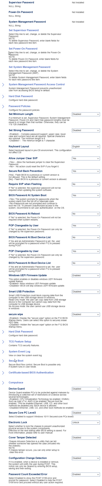

Supervisor Password

Shows the status of the password.

One of 2 possible options for password status:

1.  **Not Installed** - password disabled. Default.
2.  Installed -  password enabled.

Power-on Password

Shows the status of the password.

One of 2 possible options for password status:

1. **Not Installed** - password disabled. Default.
2. Installed -  password enabled.

System Management Password

Shows the status of the password.

One of 2 possible options for password status:

1. **Not Installed** - password disabled. Default.
2. Installed -  password enabled.

Set Supervisor Password

Set, change, or delete the Supervisor
Password.

**NOTE:** To delete Supervisor Password, enter blank fields tor
each new password line item.

Set Power-On Password

Set, change, or delete tne Power-on Password.

**NOTE:** To delete Power-On Password, enter blank fields for
each new password line item.

Set System Management Password

Set, change, or delete the System Management password (SMP).

**NOTE:** To delete system Manaqement password, enter blank fields for each new password line item.

### System Management Password Access Control ###

The system Management password prevents unauthorized users from accessing BIOS Setup in default.

Access Security Settings

Set the level of security settings access for the SMP.
One of 2 possible options for SMP security settings access:

1.  **Disabled** - disables security settings access.
2.  Enabled - enables security settings access. Default.

<!--
| WMI Setting name | Values | SVP Req'd | AMD/Intel |
|:---|:---|:---|:---|
| AccessSecuritySettings | setting_values | yes_no | amd_intel |
-->

**NOTE:** When enabled, the SMP has the same security settings access permissions as the SVP.

Remote Set SMP

description.
One of 2 possible options for remote setting of the SMP:

1.  **Disabled** - disables remote setting of the SMP.
2.  Enabled - enables remote setting of the SMP. Default.

<!--
| WMI Setting name | Values | SVP Req'd | AMD/Intel |
|:---|:---|:---|:---|
| RemoteSetSMP | setting_values | yes_no | amd_intel |
-->

<!-- 
### Hard Disk Password ###

Configure hard disk password.

### Password Policies ###

Configure the password policies

-->

Set Minimum Length

If a minimum is set, Supervisor Password, System Management Password, Power-On and Hard Disk password lengths must be equal to or longer than that number. Otherwise, they can be 1 to 128 Characters.

Set Strong Password

Complex password support, upper case, lower-case, and numeric keys are all required. Special characters are optional. The minimum length is 8.

<Disabled> - The minimum length is 1 character.

Keyboard Layout

Select keyboard layout in pre-OS environment.

This configuration dbes not affect the OS.

Allow Jumper Clear SVP

<Yes> - Allow tne hardware jumper to clear the Supervisor
password.
- NO action could reset the SVP if you forget it

Secure Roll Back Prevention

[Yes) - Flash BIOS to a previous or current version is
not allowed. This is tne default setting.
[NO] - Flash BIOS to a previous or current version is allowed.

Require SVP when Flashing

If "NO" is selected, the supervisor password will not be required when updating the system software.

BIOS Password At System Boot

<Yes> The system prompts for passwords when the system starts from the full Off or hibernate state.

Passwords are not prompted and continue to boot the OS. TO prevent unauthorized access to the system, recommend to set user authentication on the OS.

BIOS Password At Reboot

If "NO" is selected, the power-on password will not be
required when system restarts.

POP Changeable by User

If "NO" is selected, the power-on password can ony be
changed by tne supervisor password.

BIOS Password At Boot Device List

If yes and an Administrator password is set, the user
will be prompted for a password when F12 is pressed
during POST

POP Changeable by User

If "NO" is selected, the power-on password can ony be
changed by tne supervisor password.

BIOS Password At Boot Device List

If yes and an Administrator password is set, the user
will be prompted for a password when F12 is pressed
during POST

Windows UEFI Firmware Update

This option enables or disables windows I-UEFI firmware
update feature.
<Enabled> Allow windows I-UEFI firmware update.
BIOS Will Skip Windows UEFI firmware update.

Smart USB Protection

Smart USB Protection could block copying data from the
computer to the LISB storage device in windows.
Read Only mode: the user can copy data from LISB storage
device to tne computer but cannot copy data trom the
computer to LJSB storage device.
NO Access mode: the user cannot use usa storage device
in windows
secure wipe
Display the "secure Wipe" option on the 812 BIOS
Startup Menu. Users can select this option to securely erase
HDD data.
<Disabled> Hidden the "secure wipe" option on the F 12 BIOS
Startup Menu.

Hard Disk Password

configure hard disk password.

TCG Feature setup

contains TCG security features.

System Event Log

View or clear the system event log.

Sec Boot

Secure Boot flow control. Secure Boot is possible only
if System runs in user MOde.

Certificate-based BIOS Authentication

Computrace

Device Guard

Device Guard enables PCs to be protected against malware by
introducing a collective set ot restrictions on a device across
several technologies.
CPU Virtualization Tecnnoog\ be enabled, IOMMU,
enabled, TPM be enabled Ethernet, IJSB, CD, and other boot
metnods be disabled,only SATA device is allowed.
<Disabled>Etnemet, usa, CD, and other boot meth0ds be enabled.
Secure Core PC Leve13
select Enabled to support Windows 10/11 secured-core PCS leve13.
Electronic Lock
Select whether to lock the chassis to prevent unauthorized
gnysjcal access to the system components.
ffective on the next startup after BIOS setting is saved. For
more intormatjon, please reter to user manual.

Cover Tamper Detected

Chassis Intrusion Detection is a utility that can tell
whetner someone has opened the case (intruded into
the cnassis).
**NOTE:**
It Chassis tamper occurs, you can ony enter setup to
clear this error

Configuration Change Detection

It it is enabled, when a device is installed or remove,
the system will notify the user during POST This
notice can only be cleared by entering BIOS setup,
saving and then exiting.

Password Count Exceeded Error

select Enabled to snow the POST 0199 error and
prompt for password. Select Disabled to hide the POST
0199 error and proceed Without any user action required.