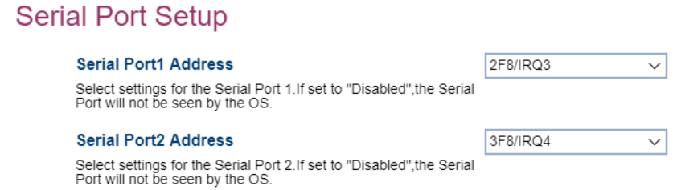

# Serial Port Setup #

Serial Port 1 Address

Choose or disable interrupt lines for serial port 1.
One of 3 possible options for serial port 1:

1.  **2F8/IRQ3** - enables the 28/IRQ3 line. Default.
2.  3F8/IRQ4 - enables 3F8/IRQ4 line.
3.  Disabled - the serial port will not be available to the OS.

Serial Port 2 Address

Choose or disable interrupt lines for serial port 2.
One of 3 possible options for serial port 2:

1.  **2F8/IRQ3** - enables the 28/IRQ3 line. Default.
2.  3F8/IRQ4 - enables 3F8/IRQ4 line.
3.  Disabled - the serial port will not be available to the OS.

