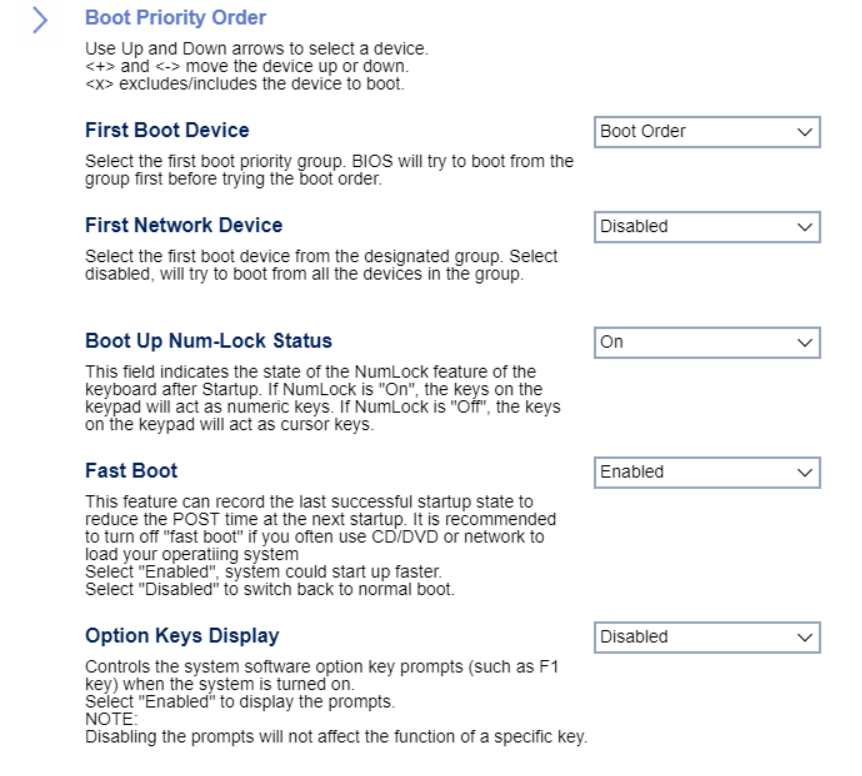

# Startup

First Boot Device

Select the first boot priority group. BIOS will try to boot from this group first before trying the boot order.

Options:

1. **Boot Order**. Default.
1. Network
1. SATA Drive
1. M.2 Drive
1. VMD Drive
1. USB HDD
1. USB CDROM

<!-- TODO: add WMI
| WMI Setting name | Values | SVP Req'd | AMD/Intel |
|:---|:---|:---|:---|
| Firstbootdevice | setting_values | yes_no | amd_intel |
-->

First Network Device

Select the first boot device from the designated group.

!> if disabled, the system will try to boot from all the devices in the group.

Options:

1. **Disabled** - the system will try to boot from all the devices in the group. Default.
1. Network1
1. Network2

Boot Up Num-Lock Status

Whether keypad keys will act as numeric keys.

Options:

1. **On** - Default.
1. Off.

<!-- TODO: add WMI
| WMI Setting name | Values | SVP Req'd | AMD/Intel |
|:---|:---|:---|:---|
| BootUpNumLockStatus | setting_values | yes_no | amd_intel |
-->

Fast Boot

Record the last successful startup state to reduce the POST time at the next startup.

?> We recommended turning off Fast Boot if you often use CD/DVD or network to load your operating system.

Options:

1.  **Enabled** - Default.
1.  Disabled.

<!-- TODO: add WMI
| WMI Setting name | Values | SVP Req'd | AMD/Intel |
|:---|:---|:---|:---|
| FastBoot | setting_values | yes_no | amd_intel |
-->

Option Keys Display

Controls the system software option key prompts (such as the F1 key) when the system is turned on.

Options:

1.  **Disabled** - Default.
2.  Enabled.

?> Disabling the prompts will not affect the function of a specific key.

<!-- TODO: add WMI
| WMI Setting name | Values | SVP Req'd | AMD/Intel |
|:---|:---|:---|:---|
| OptionKeysDisplay | setting_values | yes_no | amd_intel |
-->

