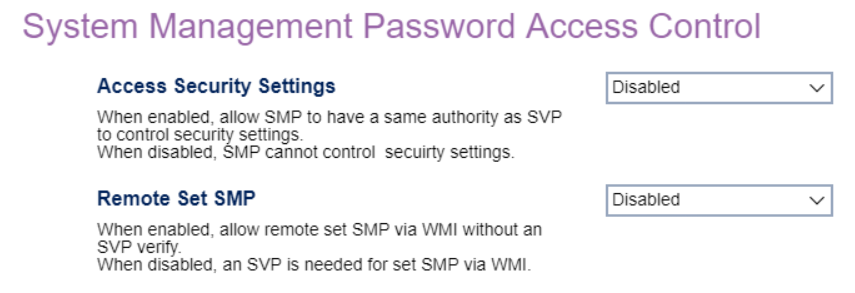

# System Management Password Access Control

Access Security Settings

Allow SMP (System Management Password) to have the same authority as SVP (Supervisor Password) to control security settings.

Options:

1.  **Disabled** - Default.
2.  Enabled.

<!-- TODO: add WMI
| WMI Setting name | Values | SVP Req'd | AMD/Intel |
|:---|:---|:---|:---|
| AccessSecuritySettings | setting_values | yes_no | amd_intel |
-->

Remote Set SMP

Allow remote setting of the SMP via WMI without SVP (Supervisor Password) verification.

Options:

1.  **Disabled** - Default.
2.  Enabled.

<!-- TODO: add WMI
| WMI Setting name | Values | SVP Req'd | AMD/Intel |
|:---|:---|:---|:---|
| RemoteSetSMP | setting_values | yes_no | amd_intel |
-->

