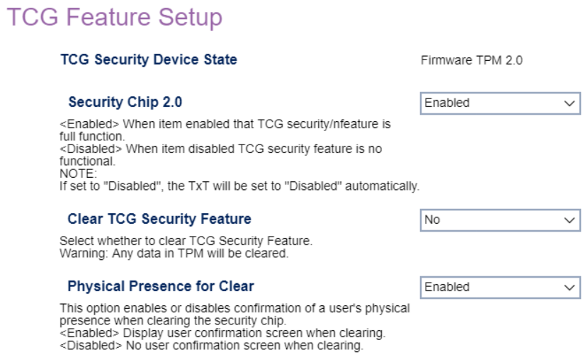

# TCG Feature setup

TCG Security Device State

Displays the current TCG Security Device (display only).

Options:

 - Discrete TPM 1.2
 - Discrete TPM 2.0
 - Firmware TPM 2.0

<!-- TODO: add WMI
-->

Security Chip 2.0

Whether the TCG security feature is fully functional.

1.  **Enabled** - Default.
1.  Disabled.

**NOTE** - If set to "Disabled", the TxT will be set to "Disabled" automatically.

<!-- TODO: add WMI
| WMI Setting name | Values | SVP Req'd | AMD/Intel |
|:---|:---|:---|:---|
| SecurityChip | setting_values | yes_no | amd_intel |
-->

Clear TCG Security Feature

Whether to clear TCG Security Feature.

**WARNING**: Any data in TPM Will be cleared.

Options:

1.  **No** - Default.
1.  Yes.

<!-- TODO: add WMI
-->

Physical Presence for Clear

Whether to require confirmation of a user's physical presence when clearing the security chip.

1.  **Enabled** - Default.
1.  Disabled.

<!-- TODO: add WMI
| WMI Setting name | Values | SVP Req'd | AMD/Intel |
|:---|:---|:---|:---|
| PhysicalPresenceforClear | setting_values | yes_no | amd_intel |
-->

