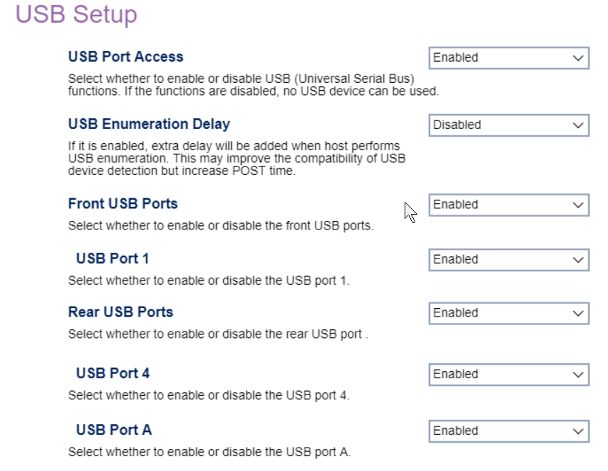

# USB Setup #

USB Port Access

One of 2 possible options for Universal Serial Bus functions:

1.  **Enabled** - enables USB. Default.
2.  Disabled - disables USB.

USB Bios Support

One of 2 possible options for bios support for USB mouse and keyboard:

1.  **Enabled** - enables USB Bios support. Default.
2.  Disabled - disables USB Bios support.

USB Enumeration Delay

One of 2 possible options for extra delay to USB enumeration (detection and recognition of connected USB devices):

1.  Enable - enables delay.
2.  **Disabled** - enables delay. Default.

Front USB Ports

One of 2 possible options for the front USB ports (numbered):

1.  **Enabled** - enables front USB ports. Default.
2.  Disabled - disables front USB ports, numbered.

> **Note:** When `Disabled` is selected, settings for all front USB ports will not be shown.

USB Port {Number}

One of the front USB ports, number depending on model.

One of 2 possible options for each specific front USB port:

1.  **Enable** - enables the front USB port. Default.
2.  Disable - disables the front USB port.

Rear USB Ports

One of 2 possible options for the rear USB ports (numbered):

1.  **Enabled** - enables rear USB ports. Default.
2.  Disabled - disables rear USB ports, numbered.

> **Note:** When `Disabled` is selected, settings for all rear USB ports will not be shown.

USB Port {Number / Letter}

One of the rear USB ports, number depending on model.

One of 2 possible options for each specific rear USB port:

1.  **Enable** - enables the rear USB port. Default.
2.  Disable - disables the rear USB port.

