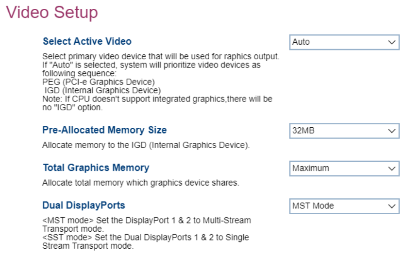

# Video Setup #

Select Active Video

The primary video device for graphics output.

Options:

1.  **Auto** - automatic selection of graphics output by the system. Default.
1.  IGD - IGD (Integrated Graphics Device).
1.  PEG - PEG (PCIe Graphic).

> **Notes**
> - If `Auto` is selected, the system will select a graphics output, **prioritizing PEG**.
> - The "IGD" option will not appear if not supported by the CPU.

<!-- TODO: add WMI -->

Pre-Allocated Memory Size

Allocate memory to the IGD (Internal Graphics Device).

Options: from **32MB** (default) to 160MB, in 32MB increments.

<!-- TODO: add WMI -->

Total Graphics Memory

Total memory shared by all graphics devices.

Options:

1.  **Maximum** - enables maximum memory allocation. Default.
2.  128MB.
3.  256MB.

Dual DisplayPorts

Enable support for MST (multi-stream transport), allowing daisy-chaining of graphics output devices.

Options:

1.  **MST** - Default.
2.  SST.

<!-- TODO: add WMI -->

