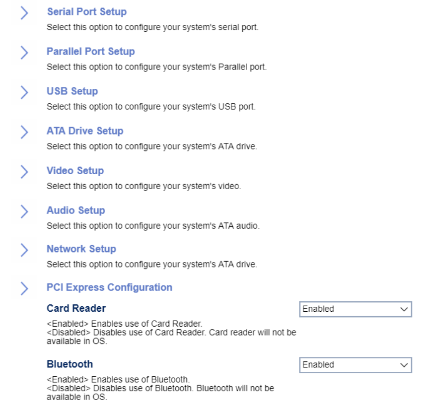

# Devices #

Bluetooth

Options:

1.  **Enabled** - Default.
1.	Disabled - disables Bluetooth connections. Bluetooth will not be available in the OS.

| WMI Setting name | Values | Locked by SVP |
|:---|:---|:---|
| Bluetooth  | Disabled, Enabled | yes |

Card Reader

Options:

1.  **Enabled** - Default.
1.  Disabled - disables card reader.

<!-- NO WMI -->

<!-- MODEL: S only -->

