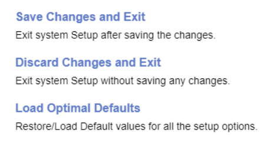

# Exit

### Save Changes and Exit ###

Exit system setup after saving the changes.

!> Save configuration and reset.

### Discard Changes and Exit ###

Exit system setup without saving any changes.

!> Reset without saving.

### Load Optimal Defaults ###

Restore / load default values for all the setup options.

!> Load default configuration.