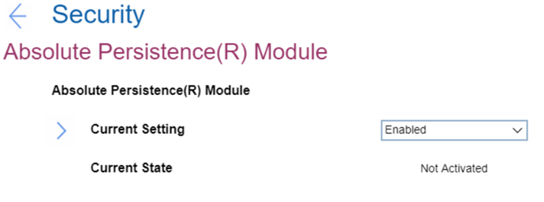

# Absolute Persistence(R) Module Settings #

Current Settings

This option enables or disables the BIOS interface to activate Absolute Persistence module. This is an optional monitoring service from Absolute Software. 
One of 3 possible states:

1.	**Enabled** – enables the activation. Default.
2.	Disabled – disables the activation.
3.	Permanently Disabled – permanently disables the activation.  
    **Note**. This selection requires additional confirmation. If this module is permanently disabled, then you will be never able to enable this setting again. 

| WMI Setting name | Values | SVP Req'd | AMD/Intel |
|:---|:---|:---|:---|
| AbsolutePersistenceModuleActivation | Disable, Enable, PermanentlyDisable | No | Both |

Current State

Shows the current status. One of 2 possible values:

1.	**Not Activated** – module is turned off. Default.
2.	Activated – Absolute Persistence is activated on OS.

| WMI Setting name | Values | SVP Req'd | AMD/Intel |
|:---|:---|:---|:---|
| Not available via WMI | N/A | N/A | N/A |

