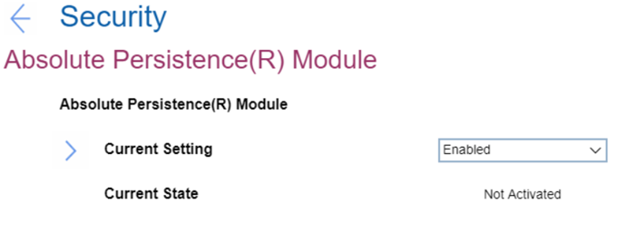

# Absolute Persistence(R) Module Settings #

The Absolute Persistence module is an optional monitoring service from Absolute Software.

Current Settings

Options:

1.	**Enabled** - Default.
2.	Disabled.
3.	Permanently Disabled – permanently disables the activation.  

!> `Permanently Disabled` requires additional confirmation. If this module is permanently disabled, then you will be never able to enable this setting again. 

| WMI Setting name | Values | SVP Req'd | AMD/Intel |
|:---|:---|:---|:---|
| AbsolutePersistenceModuleActivation | Disable, Enable, PermanentlyDisable | No | Both |

Current State

Shows the current status. Possible values:

1.	**Not Activated** – module is turned off. Default.
2.	Activated – Absolute Persistence is activated on OS.

