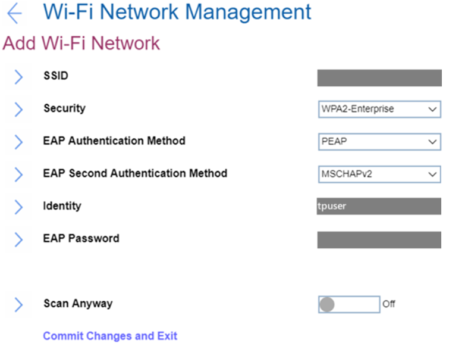

### Add Wi-Fi Network ###

?> All the settings in this group are unavailable via WMI.

### SSID ###
Field for entering SSID value.

Security

Select the security type of this Wi-Fi network.

Possible values:

1.	**Open** – Default
2.	WPA2-Personal
3.	WPA2-Enterprise

### Password ###

Enter the password.

!> Visible only for a network with security WPA2-Personal. 

Password length: 8-63 characters.

EAP Authentication Method

Select EAP Authentication Method. Possible values:

1.	**PEAP** – Default
2.	EAP-TLS

!> Visible only for a network with security WPA2-Enterprise. 

EAP Second Authentication Method

Select EAP Second Authentication Method. Possible values:

1.	**MSCHAPv2** – Default. 

!> Visible only for a network with security WPA2-Enterprise and if `EAP Authentication Method` is `PEAP`. 

Enroll CA Cert

This is the option to enroll CA (Certification Authority) certificate. Empty by default. 

!> Visible only for networks with security WPA2-Enterprise.

Enroll Client Cert

This is the option to enroll client certificate. Empty by default. 

!> Visible only for networks with security WPA2-Enterprise and if `EAP Authentication Method` is `EAP-TLS`.

Enroll Client Private Key

This is the option to enroll client private key. Empty by default. 

!> Visible only for networks with security WPA2-Enterprise and if `EAP Authentication Method` is `EAP-TLS`.

Identity

Field for entering identity value if there is any.  

Requirements for identity length: 6-20 characters. 

!> Visible only for a network with security WPA2-Enterprise. 

EAP Password

Field for entering EAP password.  

Requirements to password length: 1-63 characters. 

!> Visible only for a network with security WPA2-Enterprise. 

Scan Anyway

Whether to scan even when this network is not broadcasting its name.

Options:

1.	**On** - the network will be scanned when it does not broadcast its name. Default. 
2.	Off - the network will not be scanned when it does not broadcast its name.

!> Visible only for a network with security WPA2-Enterprise.

Commit Changes and Exit

This is the option to save changes and exits back to the Manage Wi-Fi network page. 

