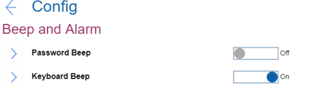

# Beep and Alarm Settings #

Password Beep

Whether system will make a beep sound when the system is waiting for a power-on, hard disk, or supervisor password.

Options:

1.	**Off** - Default.
2.	On.

    ?> Different beeps will be sounded when the entered password matches or does not match the configured password.

| WMI Setting name | Values | SVP Req'd | AMD/Intel |
|:---|:---|:---|:---|
| PasswordBeep | Disable, Enable | No | Both |

Keyboard Beep

Whether a beep will sound when unmanageable key combination is pressed.

Options:

1.	**On** - Default.
2.	Off.

| WMI Setting name | Values | SVP Req'd | AMD/Intel |
|:---|:---|:---|:---|
| KeyboardBeep | Disable, Enable | No| Both |

