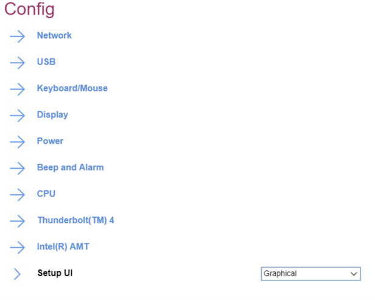

# Config #

Setup UI

Whether to enable `simple text` interface with navigation and actions available only via keyboard, or  `graphical` interface with mouse for navigation and actions.

1.	Simple Text
2.	**Graphical** - Default.

| WMI Setting name | Values | Locked by SVP | AMD/Intel |
|:---|:---|:---|:---|
| SetupUI | SimpleText, Graphical | No | Both |

