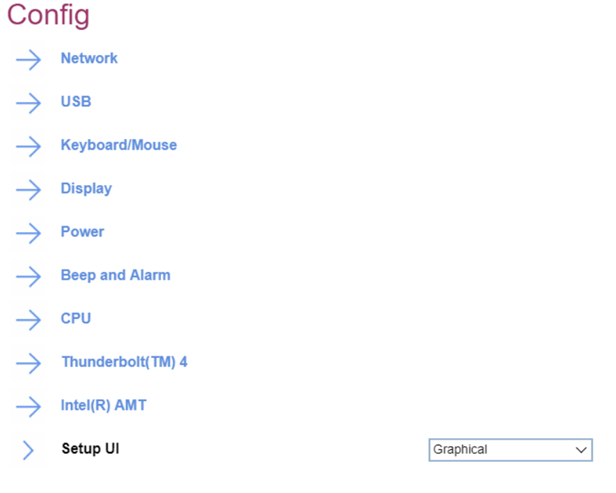

# Config #

HDMI Mode Select

One of 2 possible options:

1.	**HDMI 2.0** - Default. 
2.	HDMI 1.4

| WMI Setting name | Values | SVP Req'd | AMD/Intel |
|:---|:---|:---|:---|
| HDMIModeSelect | HDMI1.4, HDMI2.0 | No | AMD |

Setup UI

One of 2 possible options for interface of Setup:

1.	Simple Text - enables simple text interface with navigation and actions available only via keys on a keyboard.
2.	**Graphical** - enables graphical interface with possibility to additionally use mouse for navigation and actions. Default.

| WMI Setting name | Values | SVP Req'd | AMD/Intel |
|:---|:---|:---|:---|
| SetupUI | SimpleText, Graphical | No | Both |

