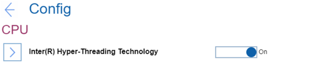

# CPU Settings #

Intel (R) Hyper-Threading Technology

One of 2 possible states:

1.	**On** - it enables additional CPU threads. These threads appear as additional processors but share some resources with the other threads within a CPU. Default.
2.	Off - it enables only one thread within each execution core unit.

| WMI Setting name | Values | Locked by SVP | AMD/Intel |
|:---|:---|:---|:---|
| HyperThreadingTechnology | Disable, Enable | No | Both |

