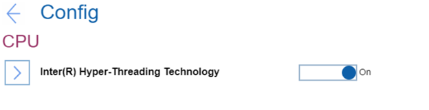

# CPU Settings #

Intel (R) Hyper-Threading Technology

Options:

1.	**On**. These threads appear as additional processors but share some resources with the other threads within a CPU. Default.
2.	Off. 

| WMI Setting name | Values | SVP Req'd | AMD/Intel |
|:---|:---|:---|:---|
| HyperThreadingTechnology | Disable, Enable | No | Both |

