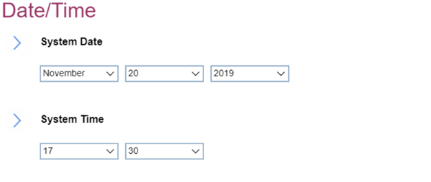

# Date\Time #

System Date

Shows the currently set system date and can be changed. < Tab >, < Shift-Tab >, or < Enter > selects field.
Possible values:

1.	Currently set date
2.	MM/DD/YYYY: 
    a. MM – Months: January to December  
    b. DD – Date: 1 ~ 31  
    c. YYYY – Year: 1980 ~ 2099  

| WMI Setting name | Values |
|:---|:---|
| Not available via WMI |  |

System Time

System Time	Shows the currently set system time and can be changed. <Tab>, <Shift-Tab>, or <Enter> selects field.
Possible values:

1.	Currently set date
2.	HH : MM : SS 
    a. HH - Hour:  00 ~ 23 
    b. MM - Minute:  00 ~ 59 
    c. SS - Second:  00 ~ 59 

| WMI Setting name | Values |
|:---|:---|
| Not available via WMI |  |

