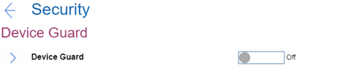

# Device Guard Settings #

Device Guard

This is a setup feature to support Microsoft (R) Device Guard. To complete the configuration of Device Guard, Supervisor Password must be set. One of 2 possible states:

1.	**Off** - Device guard is off. Default. 
2.	On - when enabled, Intel Virtualization Technology, Intel VT-d Feature, Secure Boot and OS Optimized Defaults are automatically enabled. Boot Order is restricted to customer image only.

This option requires additional confirmation.

| WMI Setting name | Values | Locked by SVP | AMD/Intel |
|:---|:---|:---|:---|
| DeviceGuard | Disable, Enable | No | Intel |

