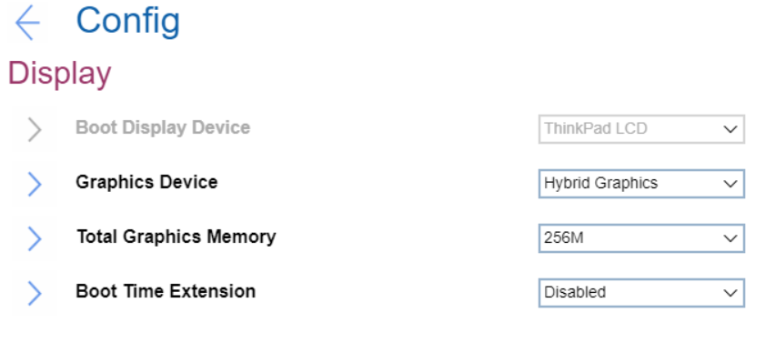

# Display Settings #

Boot Display Device

One of 2 possible options:

1.	**ThinkPad LCD** - native ThinkPad LCD will be used for boot. Default.
2.	External Display - an external display attached to USB Type-C connector or HDMI connector on ThinkPad will be used for boot.  **Note**. If multiple displays are attached, the boot screen appears on the first recognized one.

| WMI Setting name | Values |
|:---|:---|
| BootDisplayDevice |  |

Total Graphics Memory

One of 2 possible options to allocate total memory which Intel (R) internal graphics device shares:

1.	**256 MB** - Default. 
2.	512 MB - If selected, then the maximum usable memory may be reduced on 32-bit OS

| WMI Setting name | Values |
|:---|:---|
| TotalGraphicsMemory |  |

Boot Time Extension

Option to define the amount of time to extend the boot process, in seconds.

1.	**Disabled** - Default
2.	1 second
3.	2 seconds
4.	3 seconds
5.	5 seconds
6.	10 seconds

**Note**. The System cannot detect some external monitors during boot because they need a few seconds to be ready. Try this option if the monitor being used does not display the boot screen.

| WMI Setting name | Values |
|:---|:---|
| BootTimeExtension |  |

