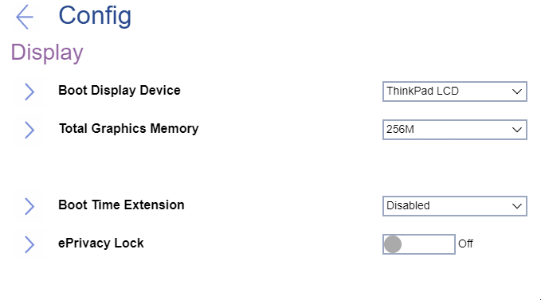

# Display Settings #

Boot Display Device

One of 2 possible options:

1.	**ThinkPad LCD** - native ThinkPad LCD will be used for boot. Default.
2.	External Display - an external display attached to USB Type-C connector or HDMI connector on ThinkPad will be used for boot.  **Note**. If multiple displays are attached, the boot screen appears on the first recognized one.

| WMI Setting name | Values | Locked by SVP | AMD/Intel |
|:---|:---|:---|:---|
| BootDisplayDevice | LCD, ExternalDisplay | No | Both |

Graphics Device

One of 2 possible options if the system includes a discrete graphics adapter:

1.	**Hybrid Graphics** - Both the integrated and the discrete graphics adapters are available to the OS. Default.
2.	Discrete Graphics - Only the discrete graphics adapater is available to the OS.

| WMI Setting name | Values | Locked by SVP | AMD/Intel |
|:---|:---|:---|:---|
| GraphicsDevice | SwitchableGfx, DiscreteGfx | No | Both |

Total Graphics Memory

**Intel-based machine**

One of 2 possible options to allocate total memory which Intel (R) internal graphics device shares:

1.	**256 MB** - Default. 
2.	512 MB - If selected, then the maximum usable memory may be reduced on 32-bit OS

| WMI Setting name | Values | Locked by SVP | AMD/Intel |
|:---|:---|:---|:---|
| TotalGraphicsMemory | 256MB, 512MB | No | Intel |

**AMD-based machine**

One of 5 possible options to allocate UMA (Unified Memory Architecture) frame buffer size:

1.	**Auto** - Default. 
2. 1GB
3. 2GB
4. 4GB
5. 8GB

| WMI Setting name | Values | Locked by SVP | AMD/Intel |
|:---|:---|:---|:---|
| UMAFramebufferSize | Auto, 1GB, 2GB, 4GB, 8GB | No | AMD |

Boot Time Extension

Option to define the amount of time to extend the boot process, in seconds.

1.	**Disabled** - Default
2.	1 second
3.	2 seconds
4.	3 seconds
5.	5 seconds
6.	10 seconds

**Note**. The System cannot detect some external monitors during boot because they need a few seconds to be ready. Try this option if the monitor being used does not display the boot screen.

| WMI Setting name | Values | Locked by SVP | AMD/Intel |
|:---|:---|:---|:---|
| BootTimeExtension | Disable, 1, 2, 3, 5, 10 | No | Both |

ePrivacy Lock

Whether to set Privacy Guard always on, and prevent the user from disabling it.

!> If switched off, Privacy Guard can be toggled any time with hotkey `Fn` + `D`.

Options:

1.  **Off** - Default.
2.  On.
<!-- TODO
| WMI Setting name | Values | SVP or SMP Req'd | AMD/Intel |
|:---|:---|:---|:---|
| ePrivacyLock | setting_values | yes_no | both | -->

