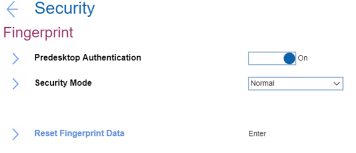

# Fingerprint Settings #

Predesktop Authentication

Whether to enable authentication by a fingerprint at predesktop.

Options:

1.	**On** - Default.
2.	Off.

| WMI Setting name | Values | SVP Req'd | AMD/Intel |
|:---|:---|:---|:---|
| FingerprintPredesktopAuthentication | Disable, Enable | No | Both |

Security Mode

Options:

1.	**Normal** - Power-On Password or Supervisor Password must be entered to boot a system when no fingerprint is authenticated. Default.
2.	High - Supervisor password must be entered to boot a system when no fingerprint is authenticated. Power-On Password is not accepted.

| WMI Setting name | Values | SVP Req'd | AMD/Intel |
|:---|:---|:---|:---|
| FingerprintSecurityMode | Normal, High | No | Both |

Password Authentication

?> Visible and active only if `Security Mode` is set to `High`.

!> Users are authenticated by passwords when fingerprints are not available.

Options:

1.	**On**. Default. 
2.	Off.

?> Administrators are authenticated by a Supervisor Password.

| WMI Setting name | Values | SVP Req'd | AMD/Intel |
|:---|:---|:---|:---|
| FingerprintPasswordAuthentication | Disable, Enable | No | Intel |

Reset Fingerprints Data

This option is used to erase all fingerprint data stored in the fingerprint reader and reset settings to the factory state (ex. Power-on security, LEDs, etc.).  

As a result, any power-on security features previously enabled will not be able to work until they are re-enabled in fingerprint software.  

The option requires additional confirmation for erasing the fingerprint data.

