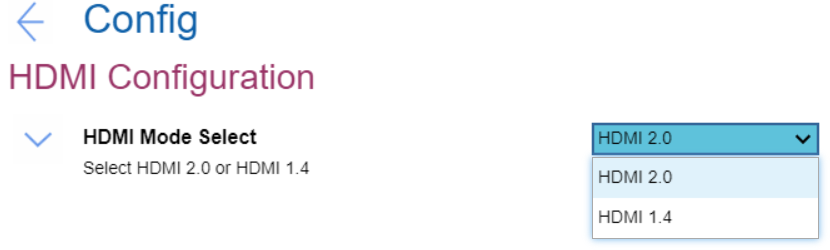

# HDMI Configuration #

Available only on certain models.

HDMI Mode Select

This setting allows for switching between HDMI modes to achieve the best compatible video output for the devices attached.

One of 2 possible options:

1. **HDMI 2.0** - Allows for higher frame rate for 4K video. Default.
2. HDMI 1.4 - Supports 4K video with lower frame rate.

