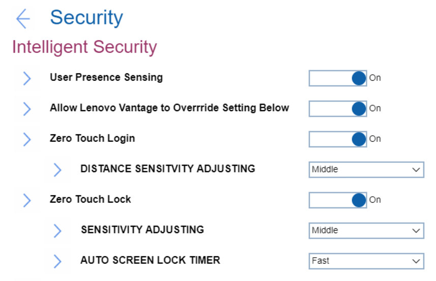

# Intelligent Security #

 - [More information at Lenovo Support](https://support.lenovo.com/uu/en/solutions/ht511536-smart-features)

User Presence Sensing

Whether to enable functions that rely on using the IR camera to recognize the user's presence and if the user is looking at the screen.

!> Before using this feature, ensure you create your Face ID with the IR camera.

 - [More information at Lenovo Support](https://support.lenovo.com/uu/en/solutions/ht511536-smart-features)

Options:

1. **On** - Default.
2. Off

| WMI Setting name | Values | SVP or SMP Req'd |
|:---|:---|:---|
| UserPresenceSensing | Disable,Enable |  |

Allow Lenovo Vantage to Override Setting Below

Whether to allow Windows® service to prioritize the settings of Lenovo Vantage, if Lenovo Vantage is installed.

 - [More information at Lenovo Support](https://support.lenovo.com/us/en/solutions/ht505081-lenovo-vantage-using-your-pc-just-got-easier)
 - [More information at Lenovo.com](https://www.lenovo.com/us/en/software/vantage)

Options:

1. **On** - Default.
2. Off. Enforce BIOS settings. 

| WMI Setting name | Values | SVP or SMP Req'd |
|:---|:---|:---|
| ZeroTouchAllowOverride | Disable,Enable |  |

Zero Touch Login

Whether to unlock or wake up the computer automatically when you are in front of it or approaching it.

Options:

1. **On** - Default.
2. Off.

| WMI Setting name | Values | SVP or SMP Req'd |
|:---|:---|:---|
| ZeroTouchLogin | Disable,Enable |  |

DISTANCE SENSITIVITY ADJUSTING

!> Depends on Windows® Hello. To use it, turn on face recognition in Windows® settings.
- [More information at Microsoft.com](https://www.support.microsoft.com/en-us/windows/learn-about-windows-hello-and-set-it-up-dae28983-8242-bb2a-d3d1-87c9d265a5f0)

Options:

1. Near
1. **Middle** - Default.
1. Far

| WMI Setting name | Values | SVP or SMP Req'd |
|:---|:---|:---|
| ZeroTouchLoginDistanceAdjusting | Near,Middle,Far |  |

Zero Touch Lock

Whether to dim the display and lock the computer when user presence is not detected.

?> Can reduce the chances of unauthorized access to the computer if you leave the computer unattended and unlocked.

Options:

1. **On** - Default.
2. Off.

| WMI Setting name | Values | SVP or SMP Req'd |
|:---|:---|:---|
| ZeroTouchLock | Disable,Enable |  |

SENSITIVITY ADJUSTING

?> Accuracy varies by body size, posture, and frequency of movement.

Options:

1. Near
1. **Middle** - Default.
1. Far

| WMI Setting name | Values | SVP or SMP Req'd |
|:---|:---|:---|
| ZeroTouchLockDistanceAdjusting | Near,Middle,Far |  |

AUTO SCREEN LOCK TIMER

?> Uses sensors and camera to detect your presence. However, it does NOT collect any personal data.

Options:

1. **Fast** - Default.
1. Medium
1. Slow

| WMI Setting name | Values | SVP or SMP Req'd |
|:---|:---|:---|
| ZeroTouchLockTimer | Fast,Medium,Slow |  |

Override Windows ® Screen time-out settings

Options:

1. **On** - Default.
2. Off.

<!-- NO WMI -->

