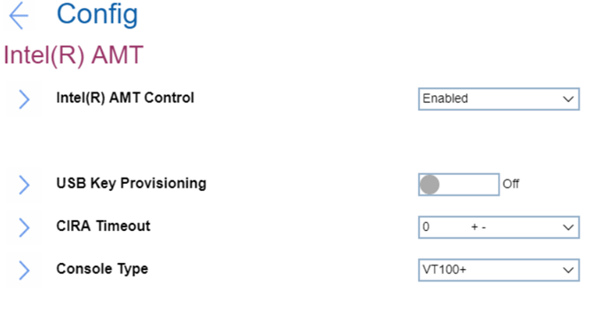

# Intel(R) AMT Settings #

Intel (R) AMT Control

One of 3 possible options:

1.	**Enabled** - Intel (R) Active Management Technology Control is enabled. Default.
2.	Disabled - Intel (R) ATM Control is disabled.
3.	Permanently Disabled - can be selected only once and permanently turns off Intel (R) ATM Control. Additional confirmation for this action will be required because it cannot be undone.

    **Attention**. If ‘Permanently Disabled’ is selected, then it will be impossible to turn back on Intel (R) AMT Control.

| WMI Setting name | Values | Locked by SVP | AMD/Intel |
|:---|:---|:---|:---|
| AMTControl | Disable, Enable | No | Intel |

USB Key Provisioning

Active only when ‘Intel (R) ATM Control’ has value ‘Enabled’.
One of 2 possible states:

1.	**Off** - disables USB key provisioning. Default.
2.	On - enables USB key provisioning.

| WMI Setting name | Values | Locked by SVP | AMD/Intel |
|:---|:---|:---|:---|
| USBKeyProvisioning | Disable, Enable | Yes | Intel |

CIRA Timeout

The option to define timeout for Client Initiated Remote Access connection to be established. 
The value is in seconds and can be varied from 1 to 254.  
0 and 255 have special meaning and described below:

* **0** - use the default timeout of 60 seconds. Default.
* 255 - wait until the connection succeeds.

Console Type

One of 4 possible options to enable a specified console type:

1.	**VT100+** - Adds function keys F5 to F14. Default.
2.	VT100 
3.	VT-UTF8 - Adds function key F8
4.	PC ANSI

**Note**. This console type must match the Intel AMT remote console.

