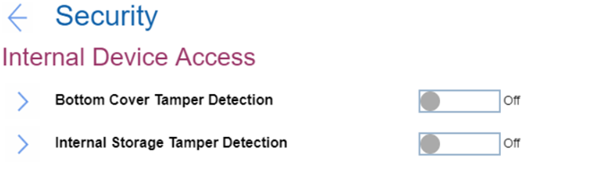

# Internal Device Access Settings #

Bottom Cover Tamper Detection

Options:

1.	On. If detected, Supervisor Password is required to boot the system.
2.	**Off** - Default.

!> Bottom Cover Tamper Detection will not take effect unless Supervisor Password is enabled.

| WMI Setting name | Values | SVP Req'd | AMD/Intel |
|:---|:---|:---|:---|
| BottomCoverTamperDetected | Disable, Enable | No | Both |

Internal Storage Tamper Detection

Options:

1.	On.S3). If a storage is removed while the system is in S3 state, the system will shutdown when woken from S3. Unsaved data will be lost.
2.	**Off** - Default.

