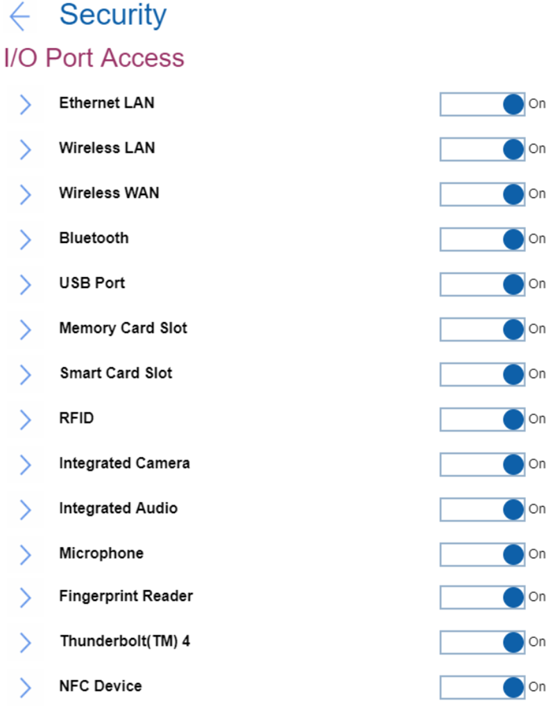

# I/O Port Access Settings #

Ethernet LAN

Select whether to enable or disable Ethernet LAN device.
One of 2 possible states:

1.	**On** – enables use of Ethernet LAN device. Default.
2.	Off - disables use of Ethernet LAN device and keeps it disabled in the OS environment.

**Note**. The setting is removed in the recent versions.

| WMI Setting name | Values | Locked by SVP | AMD/Intel |
|:---|:---|:---|:---|
| EthernetLANAccess | Disable, Enable | Yes | Both |

Wireless LAN

Select whether to enable or disable Wireless LAN device.
One of 2 possible states:

1.	**On** – enables use of Wireless LAN device. Default.
2.	Off - disables use of Wireless LAN device and keeps it disabled in the OS environment.

| WMI Setting name | Values | Locked by SVP | AMD/Intel |
|:---|:---|:---|:---|
| WirelessLANAccess | Disable, Enable | Yes | Both |

Wireless WAN

Select whether to enable or disable Wireless WAN device.
One of 2 possible states:

1.	**On** – enables use of Wireless WAN device. Default.
2.	Off - disables use of Wireless WAN device and keeps it disabled in the OS environment.

| WMI Setting name | Values | Locked by SVP | AMD/Intel |
|:---|:---|:---|:---|
| WirelessWANAccess | Disable, Enable | Yes | Both |

Bluetooth

One of 2 possible states:

1.	**On** – enables use of Bluetooth device. Default.  
    **Note**. Enabling Bluetooth requires to set ‘Wireless LAN’ to ‘Enabled’ state.
2.	Off - disables use of Bluetooth device.

| WMI Setting name | Values | Locked by SVP | AMD/Intel |
|:---|:---|:---|:---|
| BluetoothAccess | Disable, Enable | Yes | Both |

USB Port

Select whether to enable or disable all USB ports.

**Note**. This setting does not affect any USB-C (R) ports with a thunderbolt icon.

One of 2 possible states:

1.	**On** – enables use of USB ports. Default.
2.	Off – disables use of USB ports and keeps them disabled in the OS environment.

| WMI Setting name | Values | Locked by SVP | AMD/Intel |
|:---|:---|:---|:---|
| USBPortAccess | Disable, Enable | Yes | Both |

Memory Card Slot

Select whether to enable or disable memory card slot (SD Card/MultimediaCard/Memory Stick).
One of 2 possible states:

1.	**On** – enables use of Memory Card slot. Default.
2.	Off – disables use of Memory Card slot and keeps it disabled in the OS environment.

| WMI Setting name | Values | Locked by SVP | AMD/Intel |
|:---|:---|:---|:---|
| MemoryCardSlotAccess | Disable, Enable | Yes | Both |

Smart Card Slot

Select whether to enable or disable Smart Card slot.
One of 2 possible states:

1.	**On** – enables use of Smart Card slot. Default.
2.	Off – disables use of Smart Card slot and keeps it disabled in the OS environment.

| WMI Setting name | Values | Locked by SVP | AMD/Intel |
|:---|:---|:---|:---|
| SmartCardSlotAccess | Disable, Enable | Yes | Both |

RFID

Select whether to enable or disable RFID (radio-frequency identification).
One of 2 possible states:

1.	**On** – enables use of RFID. Default.
2.	Off – disables use of RFID and keeps it disabled in the OS environment.

**Note**. This feature is supported only for the [healthcare model](https://techtoday.lenovo.com/jp/ja/solutions/media/3970), where RFID is installed instead of Smart Card. Therefore, parameter for WMI command will be the same as for Smart Card.

| WMI Setting name | Values | Locked by SVP | AMD/Intel |
|:---|:---|:---|:---|
| SmartCardSlotAccess | Disable, Enable | Yes | Both |

Integrated Camera

Select whether to enable or disable Integrated Camera.
One of 2 possible states:

1.	**On** – enables use of Integrated Camera. Default.
2.	Off – disables use of Integrated Camera and keeps it disabled in the OS environment.

| WMI Setting name | Values | Locked by SVP | AMD/Intel |
|:---|:---|:---|:---|
| IntegratedCameraAccess | Disable, Enable | Yes | Both |

Integrated Audio

Select whether to enable or disable all audio functions (Microphone/Speaker).
One of 2 possible states:

1.	**On** – to enable audio functions, select ‘Enabled’ and save the setting. Then fully shut down and power on the system. Default.
2.	Off – disables use of all audio functions and keeps it disabled in the OS environment.

| WMI Setting name | Values | Locked by SVP | AMD/Intel |
|:---|:---|:---|:---|
| IntegratedAudioAccess | Disable, Enable | Yes | Both |

Microphone

Select whether to enable or disable Microphone (Internal/External/Line-In).
One of 2 possible states:

1.	**On** – to enable Microphone, select ‘Enabled’ save the setting. Then fully shut down and power on the system. Default.
2.	Off – disables use of Microphone.

| WMI Setting name | Values | Locked by SVP | AMD/Intel |
|:---|:---|:---|:---|
| MicrophoneAccess | Disable, Enable | Yes | Both |

Fingerprint Reader

Select whether to enable or disable Fingerprint Reader.
One of 2 possible states:

1.	**On** – enables use of Internal Fingerprint Reader. Default.
2.	Off – disables use of Internal Fingerprint Reader and keeps it disabled in the OS environment.

| WMI Setting name | Values | Locked by SVP | AMD/Intel |
|:---|:---|:---|:---|
| FingerprintReaderAccess | Disable, Enable | Yes | Both |

Thunderbolt (TM) 4

Select whether to enable or disable Thunderbolt 4 (PCIe/USB).

**Note**. Affects only USB-C ports with a thunderbolt icon.

One of 2 possible states:

1.	**On** – enables use of Thunderbolt 4. Default.
2.	Off – disables use of Thunderbolt 4 ports and keeps them disabled in the OS environment.

| WMI Setting name | Values | Locked by SVP | AMD/Intel |
|:---|:---|:---|:---|
| ThunderboltAccess | Disable, Enable | Yes | Both |

NFC Device

Select whether to enable or disable NFC (near-field communication) Device.

One of 2 possible states:

1.	**On** – enables use of NFC Device. Default.
2.	Off – disables use of NFC Device and keeps it disabled in the OS environment.

| WMI Setting name | Values | Locked by SVP | AMD/Intel |
|:---|:---|:---|:---|
| NfcAccess | Disable, Enable | Yes | Both |

