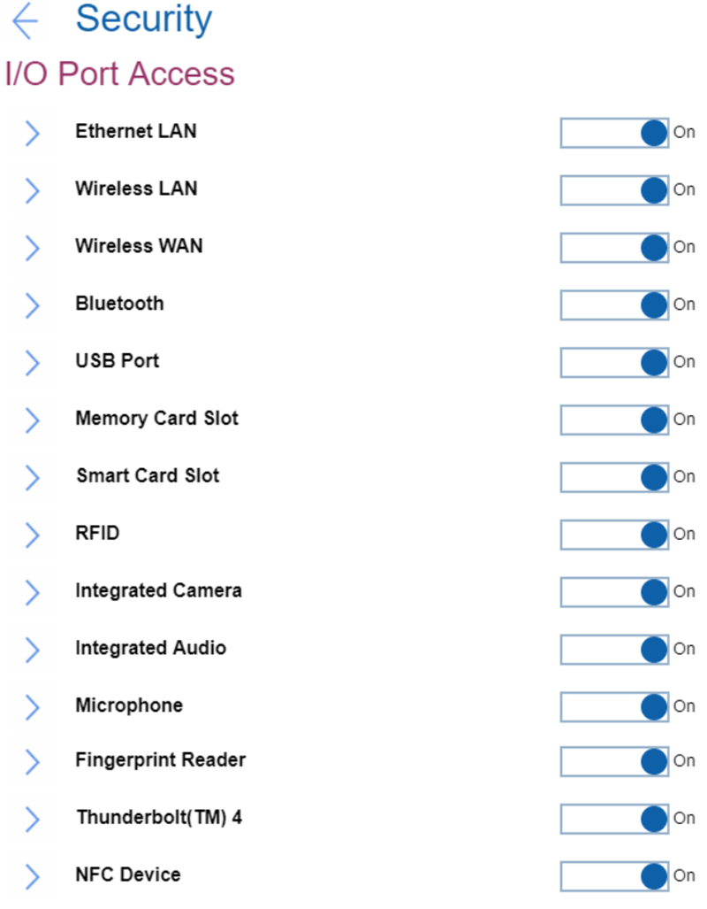

# I/O Port Access Settings #

Ethernet LAN

Select whether to enable or disable Ethernet LAN device.

Options:

1.	**On** - Default. 
2.	Off.

!> This setting is removed in the recent versions.

| WMI Setting name | Values | SVP Req'd | AMD/Intel |
|:---|:---|:---|:---|
| EthernetLANAccess | Disable, Enable | No | Both |

Wireless LAN

Select whether to enable or disable Wireless LAN device.

Options:

1.	**On** - Default. 
2.	Off.

| WMI Setting name | Values | SVP Req'd | AMD/Intel |
|:---|:---|:---|:---|
| WirelessLANAccess | Disable, Enable | No | Both |

Wireless WAN

Select whether to enable or disable Wireless WAN device.

Options:

1.	**On** - Default. 
2.	Off.

| WMI Setting name | Values | SVP Req'd | AMD/Intel |
|:---|:---|:---|:---|
| WirelessWANAccess | Disable, Enable | No | Both |

Bluetooth

Options:

1.	**On** - Default.  
2.	Off. 

?> Enabling Bluetooth requires setting `Wireless LAN` to `Enabled` state.

| WMI Setting name | Values | SVP Req'd | AMD/Intel |
|:---|:---|:---|:---|
| BluetoothAccess | Disable, Enable | No | Both |

USB Port

Select whether to enable or disable all USB ports.

!> This setting does not affect any USB-C (R) ports with a thunderbolt icon. 

Options:

1.	**On** - Default.
2.	Off.

| WMI Setting name | Values | SVP Req'd | AMD/Intel |
|:---|:---|:---|:---|
| USBPortAccess | Disable, Enable | No | Both |

Memory Card Slot

Select whether to enable or disable memory card slot (SD Card/MultimediaCard/Memory Stick).

Options:

1.	**On** - Default.
2.	Off. 

| WMI Setting name | Values | SVP Req'd | AMD/Intel |
|:---|:---|:---|:---|
| MemoryCardSlotAccess | Disable, Enable | No | Both |

Smart Card Slot

Select whether to enable or disable Smart Card slot.

Options:

1.	**On** - Default.
2.	Off.

| WMI Setting name | Values | SVP Req'd | AMD/Intel |
|:---|:---|:---|:---|
| SmartCardSlotAccess | Disable, Enable | No | Both |

RFID

Select whether to enable or disable RFID (radio-frequency identification).

Options:

1.	**On** - Default.
2.	Off.

?> This feature is supported only for the [healthcare model](https://techtoday.lenovo.com/jp/ja/solutions/media/3970), where RFID is installed instead of Smart Card. Therefore, parameter for WMI command will be the same as for Smart Card.

| WMI Setting name | Values | SVP Req'd | AMD/Intel |
|:---|:---|:---|:---|
| SmartCardSlotAccess | Disable, Enable | No | Both |

Integrated Camera

Select whether to enable or disable Integrated Camera.

Options:

1.	**On** - Default.
2.	Off.

| WMI Setting name | Values | SVP Req'd | AMD/Intel |
|:---|:---|:---|:---|
| IntegratedCameraAccess | Disable, Enable | No | Both |

Integrated Audio

Select whether to enable or disable all audio functions (Microphone/Speaker).

!> To enable audio functions, select `Enabled` and save the setting. Then fully shut down and power on the system. 

Options:

1.	**On** – Default.
2.	Off.

| WMI Setting name | Values | SVP Req'd | AMD/Intel |
|:---|:---|:---|:---|
| IntegratedAudioAccess | Disable, Enable | No | Both |

Microphone

Select whether to enable or disable Microphone (Internal/External/Line-In).

!> To enable Microphone, select `Enabled` save the setting. Then fully shut down and power on the system.

Options:

1.	**On** – Default.
2.	Off.

| WMI Setting name | Values | SVP Req'd | AMD/Intel |
|:---|:---|:---|:---|
| MicrophoneAccess | Disable, Enable | No | Both |

Fingerprint Reader

Select whether to enable or disable Fingerprint Reader.

Options:

1.	**On** - Default.
2.	Off.

| WMI Setting name | Values | SVP Req'd | AMD/Intel |
|:---|:---|:---|:---|
| FingerprintReaderAccess | Disable, Enable | No | Both |

Thunderbolt (TM) 4

Select whether to enable or disable Thunderbolt 4 (PCIe/USB).

!> Affects only USB-C ports with a thunderbolt icon.

Options:

1.	**On** - Default.
2.	Off.

| WMI Setting name | Values | SVP Req'd | AMD/Intel |
|:---|:---|:---|:---|
| ThunderboltAccess | Disable, Enable | No | Intel |

NFC Device

Select whether to enable or disable NFC (near-field communication) Device.

Options:

1.	**On** - Default.
2.	Off.

| WMI Setting name | Values | SVP Req'd | AMD/Intel |
|:---|:---|:---|:---|
| NfcAccess | Disable, Enable | No | Both |

