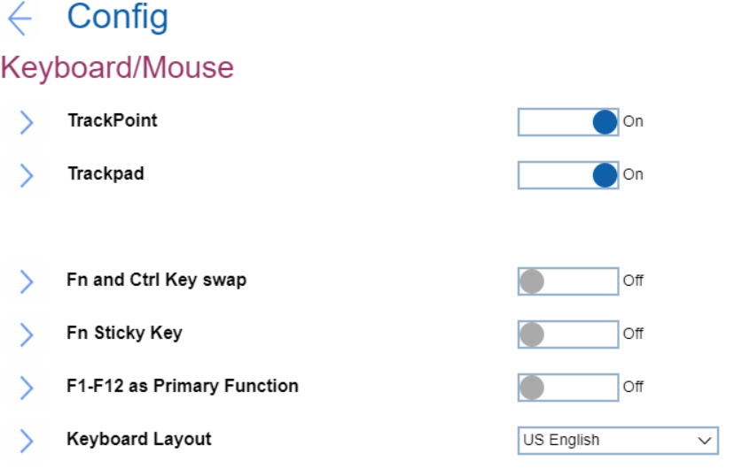

# Keyboard/Mouse Settings #

TrackPoint

One of 2 possible states:

1.	Off - Built-in Track point is disabled.
2.	**On** - Built-in TrackPoint is enabled. Default. 

| WMI Setting name | Values | Locked by SVP | AMD/Intel |
|:---|:---|:---|:---|
| TrackPoint | Enable, Disable (on AMD-based machine)   Disable, Automatic (on Intel-based machine)| No | Both |

Trackpad

One of 2 possible states:

1.	Off - Built-in Trackpad is disabled.
2.	**On** - Built-in Trackpad is enabled. Default.

| WMI Setting name | Values | Locked by SVP | AMD/Intel |
|:---|:---|:---|:---|
| TouchPad | Disable, Enable (on AMD-based machi   Disable, Automatic (on Intel-based machine)| No | Both |

Fn and Ctrl Key swap

One of 2 possible states:

1.	**Off** - Fn key and Ctrl key behaviour is as printed on the keyboard. Default.
2.	On - Fn key works as Ctrl key. Ctrl key works as Fn key. Note. Bottom-Left key will wake the system from sleep state.

| WMI Setting name | Values | Locked by SVP | AMD/Intel |
|:---|:---|:---|:---|
| FnCtrlKeySwap | Disable, Enable | No | Both |

Fn Sticky Key

One of 2 possible states:

1.	**Off** - Fn key will not switch to sticky state. Default.
2.	On - User can press Fn key to keep it in a pressed condition, then press the desired function key. The action is equivalent to pressing the required key and the Fn key simultaneously. When User presses the Fn key twice, the state is locked until User presses the Fn key again.

| WMI Setting name | Values | Locked by SVP | AMD/Intel |
|:---|:---|:---|:---|
| FnSticky | Disable, Enable | No | Both |

F1-F12 as Primary Function

One of 2 possible states:

1.	On - Executes the F1-F12 function.
2.	**Off** - Executes the special function. Default. 

Alternatively, to switch to above two options, press Fn+Esc to use FnLk (Fn Lock). LED in on when FnLk is enabled.

| WMI Setting name | Values | Locked by SVP | AMD/Intel |
|:---|:---|:---|:---|
| FnKeyAsPrimary | Disable, Enable | No | Both |

Keyboard Layout

Field to select keyboard layout in pre-OS environment. This configuration does not affect OS.
Possible options:

1.	**US English** - Default
2.	Canadian French Multilingual
3.	Canadian French
4.	Spanish (Latin America) 
5.	Portuguese (Brazil)
6.	Belgian
7.	Danish
8.	Spanish
9.	French
10.	German
11.	Hungarian
12.	Icelandic
13.	Italian
14.	Norwegian
15.	Portuguese
16.	Slovenian
17.	Swedish
18.	Swiss
19.	Turkish
20.	UK English
21.	Japanese
22.	Korean
23.	Traditional Chinese
24.	Turkish-F
25.	Estonian
26.	Finnish
27.	Czech

**Note**. On latest machines in BIOS added support for ASCII special characters and symbols such as @, ! ,?, etc. Those characters depend on keyboard layout and BIOS cannot know the attached keyboard, therefore users have to select keyboard layout if they replace keyboard.

| WMI Setting name | Values | Locked by SVP | AMD/Intel |
|:---|:---|:---|:---|
| KeyboardLayout | English_US, CanadianFrenchMultilingual, CanadianFrench,  Spanish_LA, Portuguese_BR, Belgian, Danish,  Spanish, French, German, Hungarian, Icelandic,  Italian, Norwegian, Portuguese, Slovenian,  Swedish, Swiss, Turkish, English_UK, Japanese, Korean, TraditionalChinese, Turkish-F, Estonian, Finnish, Czech | No | Both |

