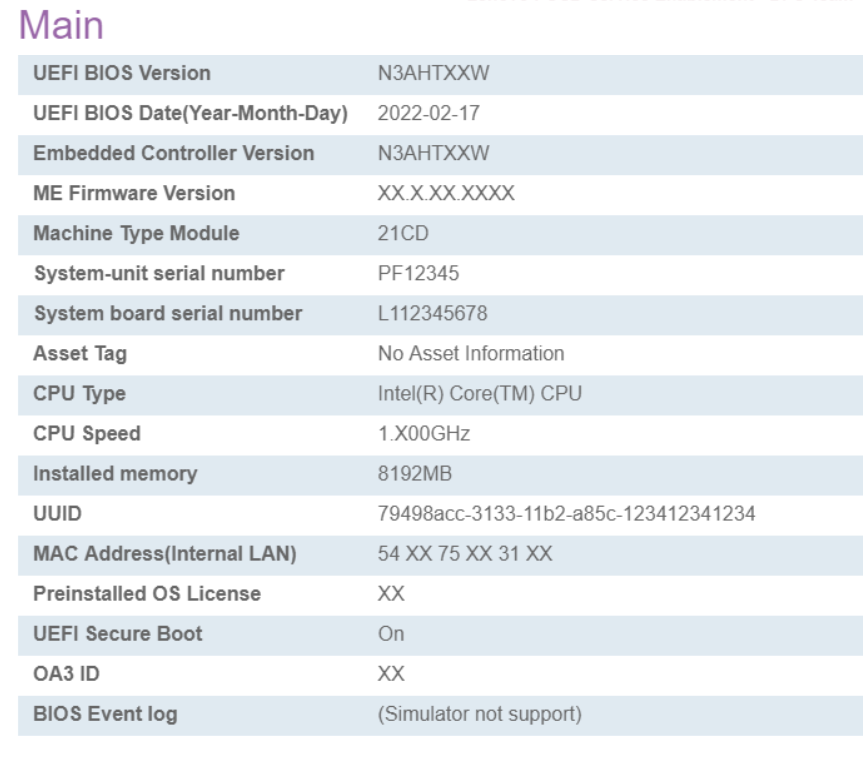

# Main #

The Main display shows (view-only) system information.

It also gives access to the [BIOS Event Log feature](http://localhost:3000/#/bios/bios_logging).

BIOS Event Log

The BIOS Event Log tracks BIOS configuration and boot events. These provide insight into the health of a device.

<!-- Options:

1.  **Disabled** - Default.
2.  Enabled.

| WMI Setting name | Values | SVP or SMP Req'd | AMD/Intel |
|:---|:---|:---|:---|
| setting_name | setting_values | yes_no | both |
 -->

